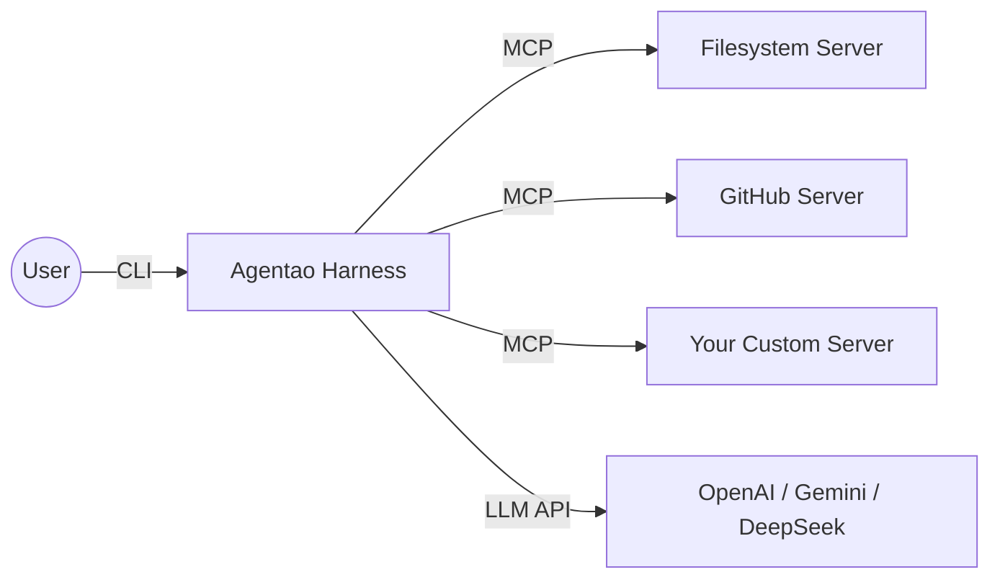

# Agentao (Agent + Tao)

```
   ___                      _
  / _ \ ___ _ ___  ___  ___| |_  ___  ___
 /  _  // _` / -_)| _ \/ _ \  _|/ _` / _ \
/_/ |_| \__, \___||_// \___/\__|\__,_\___/
        |___/        (The Way of Agents)
```

> **"Order in Chaos, Path in Intelligence."**
>
> **Agentao** is the *running path* of the intelligent agent — an Agent Harness inspired by Eastern philosophy, combining rigorous governance with fluid orchestration.
>
> *"Tao" (道) represents the underlying Laws, Methods, and Paths that govern all things. In Agentao, it is the invisible structure that keeps autonomous agents safe, connected, and observable.*

A powerful CLI agent harness with tools, skills, and MCP support. Built with Python and designed to work with any OpenAI-compatible API.

---

## Why Agentao?

Most agent frameworks give you power. **Agentao gives you power with discipline.**

The name itself encodes the design: *Agent* (capability) + *Tao* (governance). Every feature is built around three pillars of the Harness Philosophy:

| Pillar | What it means | How Agentao implements it |
|--------|--------------|--------------------------|
| **Constraint** (约束) | Agents must not act without consent | Tool Confirmation — shell, web, and destructive ops pause for human approval |
| **Connectivity** (连接) | Agents must reach the world beyond their training | MCP Protocol — seamlessly connects to any external service via stdio or SSE |
| **Observability** (可观测性) | Agents must show their work | Live Thinking display + Complete Logging — every reasoning step and tool call is visible |

**One-liner demo** — try it right after install:

```bash
# Ask Agentao to analyze the current directory
agentao -p "List all Python files here and summarize what each one does"
```

---

## Core Capabilities

### 🏛️ Autonomous Governance (自治治理)

A disciplined agent that acts deliberately, not impulsively:

- Multi-turn conversations with persistent context
- Function calling for structured tool usage
- Smart tool selection and execution
- **Tool confirmation** — user approval required for Shell, Web, and destructive Memory operations; domain-based tiered permissions for `web_fetch` (allowlist/blocklist/ask)
- **Reliability principles** — system prompt enforces read-before-assert, discrepancy reporting, and fact/inference distinction on every turn
- **Operational guidelines** — tone & style rules, shell command efficiency patterns, tool parallelism, non-interactive flags, and explain-before-act security rules
- **Auto-loading of project instructions** from `AGENTAO.md` at startup
- **Current date context** — injected as `<system-reminder>` into each user message rather than the system prompt, keeping the system prompt stable across turns for prompt cache efficiency
- **Live thinking display** — shows LLM reasoning and tool calls in real time with Rule separators
- **Streaming shell output** — shell command stdout displayed in real-time as it executes
- **Complete logging** of all LLM interactions to `agentao.log`
- **Multi-line paste support** — paste multi-line text as one unit (prompt_toolkit native; Alt+Enter for manual newline, Enter to submit)
- **Slash command Tab completion** — type `/` and press Tab for an autocomplete menu

### 🧠 Elastic Context Engine (弹性上下文引擎)

Agentao automatically manages long conversations to stay within LLM context limits:

- **Three-tier token counting** — (1) real `prompt_tokens` from provider API response after every LLM call; (2) provider `count_tokens` API (extension point); (3) local estimator: [tiktoken](https://github.com/openai/tiktoken) for GPT-4/Claude/DeepSeek families, CJK-aware character scan (ASCII = 0.25 tok/char, non-ASCII = 1.3 tok/char, adapted from [gemini-cli](https://github.com/google-gemini/gemini-cli)) as fallback. Install tiktoken with `uv sync --extra tokenizer`
- **Token breakdown** — `/status` shows context split by component: system prompt / conversation messages / tools schema, plus session-total prompt and completion tokens
- **Two-tier compression** — at 55% usage, *microcompaction* cheaply truncates old oversized tool results (no LLM call); at 65% usage, full LLM summarization kicks in and replaces early messages with a structured `[Conversation Summary]` block
- **Structured 9-section summary** — LLM summarization produces a detailed summary covering: intent, key concepts, files touched, errors & fixes, problem solving, user messages, pending tasks, current work, and next step — preserving full continuity
- **Partial compaction** — keeps the most recent 20 messages verbatim; split point advances to the next `user` boundary so tool call sequences are never split mid-flight
- **Boundary marker + file hints** — compressed history is preceded by a `[Compact Boundary]` header and a list of recently-read files so the agent knows where to re-read for details
- **Pinned messages** — messages starting with `[PIN]` are always kept verbatim and never summarized
- **Circuit breaker** — after 3 consecutive compression failures, auto-compact is disabled to prevent infinite retry loops (`/context` shows failure count)
- **Tool result truncation** — tool outputs larger than 80K characters (~20K tokens) are truncated before being added to messages
- **Auto-save summaries** — compression summaries are saved to memory with tag `conversation_summary` for future reference
- **Graceful degradation** — if compression fails, the original messages are preserved unchanged
- **Three-tier overflow recovery** — if the API returns a context-too-long error: (1) force-compress and retry; (2) if still too long, keep only the last 2 messages and retry; (3) only surfaces an error to the user if all three tiers fail

Default context limit is 200K tokens. Override with `AGENTAO_CONTEXT_TOKENS` environment variable.

### 💾 SQLite Memory (持久记忆)

A SQLite-backed persistent memory system that automatically surfaces relevant context — no vector database required.

**Storage:** Two SQLite databases, auto-created on first run:

| Database | Path | Scope |
|----------|------|-------|
| Project store | `.agentao/memory.db` | Per-project memories + session summaries |
| User store | `<home>/.agentao/memory.db` | Cross-project user preferences |

**Three data types:**

| Type | Where stored | Lifetime |
|------|-------------|----------|
| **Persistent memories** | `memories` table (soft-delete) | Until explicitly deleted |
| **Session summaries** | `session_summaries` table | Current session; cleared on `/memory clear` |
| **Recall candidates** | In-memory only (never stored) | Single turn |

**Injection strategy (per-turn, two blocks):**

1. **`<memory-stable>`** — persistent memories up to a character budget. Summaries from **previous sessions** are also appended here (pre-reserved so they are never crowded out by fact entries), giving the LLM cross-session continuity after a restart.

2. **`<memory-context>`** — top-k recall candidates scored against the current user message using a keyword / Jaccard / tag / recency formula; injected dynamically so the stable prefix stays cache-friendly.

**Retrieval performance & CJK quality:** the retriever maintains a `write_version`-gated inverted index (token → record IDs) so each recall call scores only the records that share the query tokens, avoiding a full scan as the memory store grows. CJK text is segmented with [`jieba`](https://github.com/fxsjy/jieba) word segmentation rather than character bigrams — `"版本管理"` tokenizes to `{"版本", "管理"}` instead of `{"版本", "本管", "管理"}`, eliminating the noise bigrams that polluted ranking. Single-character CJK tokens are filtered out (mirroring the Latin `len > 1` rule). Add domain-specific terms — project names, technical jargon, proper nouns — to `<home>/.agentao/userdict.txt` and jieba will pick them up on first recall.

> **Session summary channels:** the *current* session's summary lives only in `self.messages` as a `[Conversation Summary]` block (injecting it into the system prompt too would duplicate context). *Previous* sessions' summaries have no message-history channel after a restart, so they flow through `<memory-stable>` instead.

**Save a memory:**
```
❯ Remember that this project uses uv for package management
❯ Save my preferred language as Python
```

**Skill Crystallization:** `/crystallize suggest` reads the current session transcript, asks the LLM to identify the most repeatable workflow, and displays a draft `SKILL.md`. `/crystallize create [name]` writes it to `skills/` (global or project scope) and reloads skills immediately.

### 💡 Semantic Display Engine

The terminal display provides clean, low-noise tool execution output using Rich formatting:

```
→ read  src/agent.py             ← fast + silent: header only, no footer

$ pytest tests/ -q
  ...........
  … +42 lines
✓ $ pytest tests/ -q  3.1s      ← slow (≥2s): footer shown

← edit  src/agent.py
  --- a/agent.py
  +++ b/agent.py
  @@ -12,3 +12,4 @@
  -old line
  +new line
✓ edit  src/agent.py  12ms      ← diff shown: footer shown

$ pandoc doc.md -o doc.pdf
  [warning] Missing character: 'X'
  … +14 similar warnings         ← consolidated warnings
✓ $ pandoc …  1.8s
```

- **Semantic tool headers** — each tool call renders with a meaningful icon and argument preview: `→ read`  `← edit`  `$ shell`  `✱ search`  `↗ fetch`  `◈ remember`
- **Buffered output** — all output (including shell) is buffered and shown at completion; prevents screen flooding and handles `\r` progress bars, ANSI codes, and `\r\n` line endings correctly
- **Tail-biased truncation** — long output shows the last 8 lines with a `… +N lines` fold indicator; errors and results near the tail are always visible
- **Expand / collapse** — shell commands show buffered output; read/search/memory tools collapse silently; errors on collapsed tools surface the tail retroactively
- **Diff rendering** — `replace` shows a colored unified diff; `write_file` shows a syntax-highlighted content preview (first 16 lines, lexer auto-detected from extension)
- **Tool aggregation** — parallel tools in the same LLM turn shown with `  + header` prefix to signal batching
- **Live elapsed timer** — spinner updates to `tool  0.8s` for tools running longer than 0.5 s
- **Conditional completion footer** — shown only when there is output, a diff, an error, or the tool takes ≥ 2 s; fast/silent tools display a single header line only: `✓ read  32ms`  /  `✗ run_shell_command  1.2s  Permission denied`
- **Warning consolidation** — consecutive similar warnings in shell output are collapsed to a single summary: `… +N similar warnings`
- **Sub-agent lifecycle** — foreground sub-agents wrapped with cyan `▶`/`◀` rule separators; stats shown on completion
- **Thinking display** — LLM reasoning shown in dim italic style under a separator
- **Structured reasoning** — before each set of tool calls the agent prints its **Action**, **Expectation**, and **If wrong** plan — a falsifiable prediction you can verify against the actual tool result

### ✅ Session Task Tracking

For multi-step tasks, Agentao maintains a live task checklist that the LLM updates as it works:

```
/todos

Task List (2/4 completed):

  ✓ Read existing code           completed
  ✓ Design new module structure  completed
  ◉ Write new module             in_progress
  ○ Run tests                    pending
```

- **LLM-managed** — the agent calls `todo_write` at the start of complex tasks and updates statuses as each step completes (`pending` → `in_progress` → `completed`)
- **Always visible** — current task list is injected into the system prompt so the LLM always knows its own progress
- **Session-scoped** — cleared automatically on `/clear` or `/new`; not persisted to disk (unlike memory)
- **`/status` summary** — shows `Task list: 2/4 completed` when tasks are active

### 🤖 SubAgent System

Agentao can delegate tasks to independent sub-agents, each running its own LLM loop with scoped tools and turn limits. Inspired by [Gemini CLI](https://github.com/google-gemini/gemini-cli)'s "agent as tool" pattern.

**Built-in agents:**
- `codebase-investigator` — read-only codebase exploration (find files, search patterns, analyze structure)
- `generalist` — general-purpose agent with access to all tools for complex multi-step tasks

**Two trigger paths:**
1. **LLM-driven** — the parent LLM decides to delegate via `agent_codebase_investigator` / `agent_generalist` tools; supports optional `run_in_background=true` for async fire-and-forget
2. **User-driven** — use `/agent <name> <task>` to run a sub-agent directly, `/agent bg <name> <task>` for background, `/agents` to view the live dashboard

**Visual framing** — foreground sub-agents are wrapped with cyan rule separators so their output is clearly distinct from the main agent:
```
──────────── ▶ [generalist]: task description ────────────
  ⚙ [generalist 1/20] read_file (src/main.py)
  ⚙ [generalist 2/20] run_shell_command (pytest)
──────── ◀ [generalist] 3 turns · 8 tool calls · ~4,200 tokens · 12s ────
```

**Confirmation isolation:**
- Foreground sub-agents: confirmation dialog shows `[agent_name] tool_name` so you know which sub-agent is requesting permission
- Background sub-agents: all tools auto-approved (no interactive prompts from background threads, which would corrupt the terminal)

**Cancellation propagation** — pressing Ctrl+C cleanly stops the current agent and any foreground sub-agent in progress (they share the same `CancellationToken`). Background agents are unaffected — they run to completion independently.

**Background completion push** — when a background agent finishes, the parent LLM is automatically notified at the start of the next turn via a `<system-reminder>` message, without needing to poll `check_background_agent`.

**Parent context injection** — sub-agents receive the last 10 parent messages as context so they understand the broader task.

**Custom agents:** create `.agentao/agents/my-agent.md` with YAML frontmatter (`name`, `description`, `tools`, `max_turns`) — auto-discovered at startup.

### 🔌 MCP (Model Context Protocol) Support

Connect to external MCP tool servers to dynamically extend the agent's capabilities. Agentao acts as the central hub connecting your LLM brain to the outside world:



- **Stdio transport** — spawn a local subprocess (e.g. `npx @modelcontextprotocol/server-filesystem`)
- **SSE transport** — connect to remote HTTP/SSE endpoints
- **Auto-discovery** — tools are discovered on startup and registered as `mcp_{server}_{tool}`
- **Confirmation** — MCP tools require user confirmation unless the server is marked `"trust": true`
- **Env var expansion** — `$VAR` and `${VAR}` syntax in config values
- **Two-level config** — project `.agentao/mcp.json` overrides global `<home>/.agentao/mcp.json`

### 🧩 Plugin System

Agentao supports a **Claude Code-compatible plugin system** that lets you extend the agent with custom skills, commands, agents, MCP servers, and hooks — all packaged in a single directory with a `plugin.json` manifest.

**Plugin sources** (lowest to highest precedence):
1. **Global:** `<home>/.agentao/plugins/{marketplace}/{name}/{version}/`
2. **Project:** `.agentao/plugins/{marketplace}/{name}/{version}/`
3. **Inline:** `--plugin-dir /path/to/plugin` (highest priority)

**What a plugin can provide:**
- **Skills & Commands** — auto-registered with `plugin:skill` namespacing
- **Agents** — sub-agent definitions (`.md` with YAML frontmatter)
- **MCP Servers** — additional tool servers merged at startup
- **Hooks** — lifecycle hooks that fire on events (see [Hooks System](#hooks-system) below)

**CLI management:**
```bash
agentao plugin list              # Show loaded plugins with diagnostics
agentao plugin list --json       # JSON output
agentao skill install owner/repo # Install a skill from GitHub
agentao skill list               # List all skills (managed + unmanaged)
agentao skill remove my-skill    # Remove an installed skill
agentao skill update --all       # Update all managed skills
```

**Creating a plugin:**
```
my-plugin/
├── plugin.json     # Manifest (name, version, hooks, skills, etc.)
├── skills/         # SKILL.md files auto-discovered
├── commands/       # Command .md files
├── agents/         # Agent definition .md files
└── hooks/
    └── hooks.json  # Hook rules
```

Minimal `plugin.json`:
```json
{
  "name": "my-plugin",
  "version": "1.0.0",
  "description": "My custom plugin",
  "hooks": "./hooks/hooks.json"
}
```

### 🪝 Hooks System

Agentao implements a subset of the [Claude Code hooks](https://docs.anthropic.com/en/docs/claude-code/hooks) protocol, allowing plugins to react to agent lifecycle events by running external commands or injecting context.

#### Supported Hook Events

| Event | Type | Description | Claude Code Compat |
|-------|------|-------------|-------------------|
| `UserPromptSubmit` | command, prompt | Before the user's message is sent to the LLM | ✅ Full |
| `PreToolUse` | command | Before a tool executes | ✅ Full |
| `PostToolUse` | command | After a tool succeeds | ✅ Full |
| `PostToolUseFailure` | command | After a tool fails | ✅ Full |
| `SessionStart` | command | When a session begins | ✅ Full |
| `SessionEnd` | command | When a session ends | ✅ Full |

#### Unsupported Hook Events (Claude Code only)

| Event | Status | Notes |
|-------|--------|-------|
| `Notification` | ❌ Not implemented | Agentao does not emit notification events |
| `Stop` | ❌ Not implemented | No stop-reason hook |
| `SubagentTool` | ❌ Not implemented | Sub-agent tool calls are not hooked |

#### Supported Hook Types

| Type | Supported | Description |
|------|-----------|-------------|
| `command` | ✅ Yes | Run a shell command; receives JSON payload via stdin |
| `prompt` | ✅ Yes | Inject text into context (UserPromptSubmit only) |
| `http` | ⚠️ Recognized, skipped | Parsed but not dispatched (warning emitted) |
| `agent` | ⚠️ Recognized, skipped | Parsed but not dispatched (warning emitted) |

#### Hook Rules Format (`hooks.json`)

```json
[
  {
    "event": "PreToolUse",
    "hooks": [
      {
        "type": "command",
        "command": "python ./hooks/lint-check.py",
        "matcher": { "toolName": "Bash" }
      }
    ]
  },
  {
    "event": "UserPromptSubmit",
    "hooks": [
      {
        "type": "prompt",
        "prompt": "Always respond in formal English."
      },
      {
        "type": "command",
        "command": "node ./hooks/validate-input.js"
      }
    ]
  }
]
```

#### Tool Name Aliasing (Claude Code Compatibility)

Hook payloads use **Claude Code tool names** so hooks written for Claude Code work in Agentao without modification:

| Agentao Tool | Claude Code Name |
|-------------|-----------------|
| `read_file` | `Read` |
| `write_file` | `Write` |
| `replace` | `Edit` |
| `run_shell_command` | `Bash` |
| `glob` | `Glob` |
| `search_file_content` | `Grep` |
| `web_fetch` | `WebFetch` |
| `google_web_search` | `WebSearch` |
| `list_directory` | `LS` |

A `matcher` like `{ "toolName": "Bash" }` will match Agentao's `run_shell_command` tool. Glob patterns are supported: `{ "toolName": "Read*" }`.

#### Command Hook I/O Protocol

Command hooks receive a JSON payload via **stdin** and can output JSON to **stdout**:

**Input (stdin):**
```json
{
  "event": "PreToolUse",
  "data": {
    "toolName": "Bash",
    "toolInput": { "command": "rm -rf /tmp/test" },
    "sessionId": "abc-123"
  }
}
```

**Output (stdout) — optional:**
```json
{ "additionalContext": "Reminder: always use --dry-run first" }
```
```json
{ "blockingError": "Dangerous command blocked by policy" }
```
```json
{ "preventContinuation": true, "stopReason": "Rate limit reached" }
```

Non-JSON output is treated as additional context. No output = success (side-effect only).

### 🎯 Dynamic Skills System

Skills are auto-discovered from the `skills/` directory. Each subdirectory contains a `SKILL.md` file with YAML frontmatter. Skills are listed in the system prompt and can be activated with the `activate_skill` tool.

Add new skills by creating a directory with a `SKILL.md` file — no code changes needed. Or use **Skill Crystallization** to generate one from your current session: `/crystallize suggest` drafts a skill from the session transcript; `/crystallize create [name]` writes it and reloads skills immediately.

Skills can also be installed from GitHub:
```bash
agentao skill install owner/repo    # Install from GitHub
agentao skill list --installed      # Show managed installs
agentao skill update my-skill       # Update to latest
agentao skill remove my-skill       # Uninstall
```

### 🛠️ Comprehensive Tools

**File Operations:**
- `read_file` - Read file contents
- `write_file` - Write content to files (requires confirmation)
- `replace` - Edit files by replacing text
- `list_directory` - List directory contents

**Search & Discovery:**
- `glob` - Find files matching patterns (supports `**` for recursive search)
- `search_file_content` - Search text in files with regex support

**Shell & Web:**
- `run_shell_command` - Execute shell commands (requires confirmation)
- `web_fetch` - Fetch and extract content from URLs (domain-tiered: trusted sites auto-allow, loopback/metadata auto-deny, others ask); uses [Crawl4AI](https://github.com/unclecode/crawl4ai) for clean Markdown output if installed, otherwise falls back to plain text extraction
- `google_web_search` - Search the web via DuckDuckGo (requires confirmation)

**Task Tracking:**
- `todo_write` - Update the session task checklist (pending → in_progress → completed); use `/todos` to view

**Agents & Skills:**
- `agent_codebase_investigator` - Delegate read-only codebase exploration to a sub-agent (supports `run_in_background`)
- `agent_generalist` - Delegate complex multi-step tasks to a sub-agent (supports `run_in_background`)
- `check_background_agent` - Poll the status of a background sub-agent by ID; pass empty string to list all
- `activate_skill` - Activate specialized skills for specific tasks
- `ask_user` - Pause and ask the user a clarifying question mid-task

**MCP Tools:**
- Dynamically discovered from connected MCP servers
- Named `mcp_{server}_{tool}` (e.g. `mcp_filesystem_read_file`)
- Require confirmation unless server is trusted

---

## Design Principles

Agentao is built around three foundational principles:

1. **Minimalism (极简)** — Zero friction to start. `pip install agentao` and you're running. No databases, no complex config, no cloud dependencies.

2. **Transparency (透明)** — No black boxes. The agent's reasoning chain is displayed in real time. Every LLM request, tool call, and token count is logged to `agentao.log`. You always know what the agent is doing and why.

3. **Integrity (完整)** — Context is never silently lost. Conversation history is compressed with LLM summarization (not truncated blindly), and memory recall ensures relevant context resurfaces automatically. The agent maintains a coherent world-model across sessions.

---

## Installation

### Prerequisites
- Python 3.10 or higher
- An API key (OpenAI, Anthropic, Gemini, DeepSeek, or any OpenAI-compatible provider)

### Install

```bash
pip install agentao
```

Then create a `.env` file with your API key:

```bash
echo "OPENAI_API_KEY=your-api-key-here" > .env
```

### For contributors (source install)

```bash
git clone https://github.com/jin-bo/agentao
cd agentao
uv sync
cp .env.example .env
```

---

## Minimum Viable Configuration

Everything you need to get Agentao running from scratch.

### Supported Python versions

| Version | Status |
|---------|--------|
| 3.10 | ✅ supported |
| 3.11 | ✅ supported |
| 3.12 | ✅ supported |
| < 3.10 | ❌ not supported |

Verify before installing:

```bash
python --version   # must be 3.10 or higher
```

### Required environment variable

Only one variable is mandatory to start Agentao:

| Variable | Required | Example |
|----------|----------|---------|
| `OPENAI_API_KEY` | **Yes** (default provider) | `sk-...` |

All other variables are optional. The absolute minimum `.env`:

```env
OPENAI_API_KEY=sk-your-key-here
```

Create it in the directory where you run `agentao`:

```bash
echo "OPENAI_API_KEY=sk-your-key-here" > .env
```

> **Note:** Agentao loads `.env` from the *current working directory*, then falls back to `~/.env`. No system-level setup is needed.

### Default provider behavior

When no provider is explicitly configured, Agentao uses these defaults:

| Setting | Default | Override with |
|---------|---------|---------------|
| Provider | `OPENAI` | `LLM_PROVIDER=ANTHROPIC` |
| API key | `$OPENAI_API_KEY` | `$<PROVIDER>_API_KEY` |
| Model | `gpt-5.4` | `OPENAI_MODEL=gpt-4o` |
| Base URL | OpenAI public API | `OPENAI_BASE_URL=https://...` |
| Temperature | `0.2` | `LLM_TEMPERATURE=0.7` |

Each provider reads its own `<NAME>_API_KEY`, `<NAME>_BASE_URL`, and `<NAME>_MODEL`:

```env
# Use Anthropic Claude instead of OpenAI
LLM_PROVIDER=ANTHROPIC
ANTHROPIC_API_KEY=sk-ant-...
ANTHROPIC_MODEL=claude-sonnet-4-6
ANTHROPIC_BASE_URL=https://api.anthropic.com/v1
```

### Minimal runnable example

```bash
pip install agentao
echo "OPENAI_API_KEY=sk-your-key-here" > .env

# Verify it works without a UI (exits after one response)
agentao -p "Reply with the single word: OK"
```

Expected output:

```
OK
```

If that works, start the interactive session:

```bash
agentao
```

### Troubleshooting common startup failures

| Symptom | Likely cause | Fix |
|---------|-------------|-----|
| `AuthenticationError` | Missing or invalid API key | Ensure `OPENAI_API_KEY` is set correctly in `.env` |
| `NotFoundError: model not found` | Model name doesn't match provider | Set `OPENAI_MODEL=gpt-4o` (or the correct model for your provider) |
| `APIConnectionError` | Network / firewall / proxy issue | Check your internet connection; set `OPENAI_BASE_URL` if behind a proxy |
| `command not found: agentao` | CLI not on PATH | Confirm install succeeded; add `~/.local/bin` (Linux/Mac) or `Scripts\` (Windows) to `$PATH` |
| Starts but gives wrong-provider errors | `LLM_PROVIDER` mismatch | Make sure `LLM_PROVIDER` matches the key you provided (e.g. `LLM_PROVIDER=OPENAI` with `OPENAI_API_KEY`) |
| `ModuleNotFoundError` on startup | Incomplete install | Re-run `pip install agentao`; check Python version ≥ 3.10 |
| `.env` not loaded | File in wrong directory | Run `agentao` from the directory containing `.env`, or place it in `~/.env` |

---

## Configuration

Edit `.env` with your settings:

```env
# Required: Your API key
OPENAI_API_KEY=your-api-key-here

# Optional: Base URL for OpenAI-compatible APIs
# OPENAI_BASE_URL=https://api.openai.com/v1

# Optional: Model name
# OPENAI_MODEL=gpt-4-turbo-preview

# Optional: Context window limit in tokens (default: 200000)
# AGENTAO_CONTEXT_TOKENS=200000

# Optional: Maximum tokens the LLM may generate per response (default: 65536)
# LLM_MAX_TOKENS=65536

# Optional: LLM sampling temperature (default: 0.2)
# LLM_TEMPERATURE=0.2
```

### MCP Server Configuration

Create `.agentao/mcp.json` in your project (or `<home>/.agentao/mcp.json` for global servers):

```json
{
  "mcpServers": {
    "filesystem": {
      "command": "npx",
      "args": ["-y", "@modelcontextprotocol/server-filesystem", "/path/to/dir"],
      "trust": true
    },
    "github": {
      "command": "npx",
      "args": ["-y", "@modelcontextprotocol/server-github"],
      "env": { "GITHUB_TOKEN": "$GITHUB_TOKEN" }
    },
    "remote-api": {
      "url": "https://api.example.com/sse",
      "headers": { "Authorization": "Bearer $API_KEY" },
      "timeout": 30
    }
  }
}
```

| Field | Description |
|-------|-------------|
| `command` | Executable for stdio transport |
| `args` | Command-line arguments |
| `env` | Extra environment variables (supports `$VAR` / `${VAR}` expansion) |
| `cwd` | Working directory for subprocess |
| `url` | SSE endpoint URL |
| `headers` | HTTP headers for SSE transport |
| `timeout` | Connection timeout in seconds (default: 60) |
| `trust` | Skip confirmation for this server's tools (default: false) |

MCP servers connect automatically on startup. Use `/mcp list` to check status.

### Using with Different Providers

Agentao supports switching between providers at runtime with `/provider`. Add credentials for each provider to your `.env` (or `~/.env`) using the naming convention `<NAME>_API_KEY`, `<NAME>_BASE_URL`, and `<NAME>_MODEL`:

```env
# OpenAI (default)
OPENAI_API_KEY=sk-...
OPENAI_MODEL=gpt-4-turbo-preview

# Gemini
GEMINI_API_KEY=...
GEMINI_BASE_URL=https://generativelanguage.googleapis.com/v1beta/openai/
GEMINI_MODEL=gemini-2.0-flash

# DeepSeek
DEEPSEEK_API_KEY=...
DEEPSEEK_BASE_URL=https://api.deepseek.com/v1
DEEPSEEK_MODEL=deepseek-chat
```

Then switch at runtime:
```
/provider           # list detected providers
/provider GEMINI    # switch to Gemini
/model              # see available models on the new endpoint
```

The `/provider` command detects any `*_API_KEY` entry already loaded into the environment, so it works with `~/.env` and system environment variables — not just a local `.env` file.

---

## Usage

### Starting the Agent

```bash
agentao
```

### Non-Interactive (Print) Mode

Use `-p` / `--print` to send a single prompt, get a plain-text response on stdout, and exit — no UI, no confirmations. Useful for scripting and pipes.

```bash
# Basic usage
agentao -p "What is 2+2?"

# Read from stdin
echo "Summarize this: hello world" | agentao -p

# Combine -p argument with stdin (both are joined and sent as one prompt)
echo "Some context" | agentao -p "Summarize the stdin"

# Pipe output to a file
agentao -p "List 3 prime numbers" > output.txt

# Use in a pipeline
agentao -p "Translate to French: Good morning" | pbcopy
```

In print mode all tools are auto-confirmed (no interactive prompts). The exit code is `0` on success and `1` on error.

### Headless / SDK Use

Embed Agentao in your own Python code with no terminal UI:

```python
from agentao import Agentao
from agentao.transport import SdkTransport

events = []
transport = SdkTransport(
    on_event=events.append,           # receive typed AgentEvents
    confirm_tool=lambda n, d, a: True,  # auto-approve all tools
)
agent = Agentao(transport=transport)
response = agent.chat("Summarize the current directory")
```

`SdkTransport` accepts four optional callbacks: `on_event`, `confirm_tool`, `ask_user`, `on_max_iterations`. Omit any you don't need — unset ones fall back to safe defaults (auto-approve, sentinel for ask_user, stop on max iterations).

For fully silent headless use with no callbacks, just `Agentao()` — it uses `NullTransport` automatically.

### ACP (Agent Client Protocol) Mode

Launch Agentao as an [ACP](https://github.com/zed-industries/agent-client-protocol) stdio JSON-RPC server so ACP-compatible clients (e.g. Zed) can drive Agentao as their agent runtime:

```bash
agentao --acp --stdio
# or, when the console script isn't on PATH:
python -m agentao --acp --stdio
```

The server reads newline-delimited JSON-RPC 2.0 messages on stdin, writes responses and `session/update` notifications on stdout, and routes logs (and any stray `print`) to stderr. Press Ctrl-D or close stdin to shut down cleanly.

**Supported methods:** `initialize`, `session/new`, `session/prompt`, `session/cancel`, `session/load`. Tool confirmations are surfaced via server→client `session/request_permission` requests with `allow_once` / `allow_always` / `reject_once` / `reject_always` options. Per-session `cwd` and `mcpServers` injection are supported; multi-session isolation (cancel/permission/messages) is enforced.

**v1 limits:** stdio transport only; `text` and `resource_link` content blocks only (image/audio/embedded resource are rejected with `INVALID_PARAMS`); MCP servers limited to stdio + sse (http capability is `false`); ACP-level `fs/*` and `terminal/*` host capabilities are not proxied — files and shell commands run locally in the session's `cwd`.

See **[docs/ACP.md](docs/ACP.md)** for the full launch flow, supported method table, capability advertisement, annotated NDJSON transcript, event mapping reference, troubleshooting, and contributor notes.

### ACP Client — Project-Local Server Management

In addition to acting *as* an ACP server, Agentao can also act *as* an ACP client — connecting to and managing project-local ACP servers. These are external agent processes that communicate over stdio using JSON-RPC 2.0 with NDJSON framing.

**Configuration:** Create `.agentao/acp.json` in your project root:

```json
{
  "servers": {
    "planner": {
      "command": "node",
      "args": ["./agents/planner/index.js"],
      "env": { "LOG_LEVEL": "info" },
      "cwd": ".",
      "description": "Planning agent",
      "autoStart": true
    },
    "reviewer": {
      "command": "python",
      "args": ["-m", "review_agent"],
      "cwd": "./agents/reviewer",
      "description": "Code review agent",
      "autoStart": false,
      "requestTimeoutMs": 120000
    }
  }
}
```

**Server lifecycle:**

```
configured → starting → initializing → ready ↔ busy → stopping → stopped
                                         ↕
                                   waiting_for_user
```

**CLI commands:**

| Command | Description |
|---------|-------------|
| `/acp` | Overview of all servers |
| `/acp start <name>` | Start a server |
| `/acp stop <name>` | Stop a server |
| `/acp restart <name>` | Restart a server |
| `/acp send <name> <msg>` | Send a prompt (auto-connects) |
| `/acp cancel <name>` | Cancel active turn |
| `/acp status <name>` | Detailed status |
| `/acp logs <name> [n]` | View stderr output (last n lines) |
| `/acp approve <name> <id>` | Approve a permission request |
| `/acp reject <name> <id>` | Reject a permission request |
| `/acp reply <name> <id> <text>` | Reply to an input request |

**Interaction bridge:** When an ACP server needs user input (permission confirmation or free-form text), it sends a notification that becomes a pending interaction. These appear in the inbox and in `/acp status <name>`.

**Extension method:** Agentao advertises a private `_agentao.cn/ask_user` extension for requesting free-form text input from the user, enabling richer server-to-user interaction beyond simple permission grants.

**Key design decisions:**
- **Project-only config** — no global `<home>/.agentao/acp.json`; ACP servers are project-scoped
- **No auto-send** — messages are never automatically routed to ACP servers; use `/acp send` explicitly
- **Separate inbox** — server output appears in the ACP inbox, not in the main conversation context
- **Lazy initialization** — the ACP manager is created on first `/acp` command, not at startup

See **[docs/features/acp-client.md](docs/features/acp-client.md)** for the full configuration reference, lifecycle details, interaction bridge protocol, diagnostics, and troubleshooting guide.

### Commands

All commands start with `/`. Type `/` and press **Tab** for autocomplete.

| Command | Description |
|---------|-------------|
| `/help` | Show help message |
| `/clear` | Save current session, clear conversation history and all memories, start fresh |
| `/new` | Alias for `/clear` |
| `/status` | Show message count, model, active skills, memory count, context usage |
| `/model` | Fetch and list available models from the configured API endpoint |
| `/model <name>` | Switch to specified model (e.g., `/model gpt-4`) |
| `/provider` | List available providers (detected from `*_API_KEY` env vars) |
| `/provider <NAME>` | Switch to a different provider (e.g., `/provider GEMINI`) |
| `/skills` | List available and active skills |
| `/memory` | List all saved memories |
| `/memory user` | Show user-scope memories (<home>/.agentao/memory.db) |
| `/memory project` | Show project-scope memories (.agentao/memory.db) |
| `/memory session` | Show current session summary (from session_summaries table) |
| `/memory status` | Show memory counts, session size, and recall hit count |
| `/memory search <query>` | Search memories (searches keys, tags, and values) |
| `/memory tag <tag>` | Filter memories by tag |
| `/memory delete <key>` | Delete a specific memory |
| `/memory clear` | Clear all memories (with confirmation) |
| `/crystallize suggest` | Analyze session transcript and draft a reusable skill |
| `/crystallize create [name]` | Write the skill draft to skills/ (prompts for name and scope) |
| `/mcp` | List MCP servers with status and tool counts |
| `/mcp add <name> <cmd\|url>` | Add an MCP server to project config |
| `/mcp remove <name>` | Remove an MCP server from project config |
| `/context` | Show current context window usage (tokens and %) |
| `/context limit <n>` | Set context window limit (e.g., `/context limit 100000`) |
| `/agent` | List available sub-agents |
| `/agent list` | Same as `/agent` |
| `/agent <name> <task>` | Run a sub-agent in foreground (with ▶/◀ visual boundary) |
| `/agent bg <name> <task>` | Run a sub-agent in background (returns agent ID immediately) |
| `/agent dashboard` | Live auto-refreshing dashboard of all background agents |
| `/agent status` | Show all background agent tasks (status, elapsed, stats) |
| `/agent status <id>` | Show full result or error for a specific background agent |
| `/agents` | Shorthand for `/agent dashboard` |
| `/mode` | Show current permission mode |
| `/mode read-only` | Block all write and shell tools |
| `/mode workspace-write` | Allow file writes and safe read-only shell; ask for web (default) |
| `/mode full-access` | Allow all tools without prompting |
| `/plan` | Enter plan mode (LLM researches and drafts a plan; no mutations allowed) |
| `/plan show` | Display the saved plan file |
| `/plan implement` | Exit plan mode, restore prior permissions, display saved plan |
| `/plan clear` | Archive and clear the current plan; exit plan mode |
| `/plan history` | List recently archived plans |
| `/copy` | Copy last agent response to clipboard (Markdown) |
| `/sessions` | List saved sessions |
| `/sessions resume <id>` | Resume a saved session |
| `/sessions delete <id>` | Delete a specific session |
| `/sessions delete all` | Delete all saved sessions (with confirmation) |
| `/todos` | Show the current session task list with status icons |
| `/tools` | List all registered tools with descriptions |
| `/tools <name>` | Show parameter schema for a specific tool |
| `/exit` or `/quit` | Exit the program |

### Permission Modes (Safety Feature)

Agentao controls which tools execute automatically versus which require user confirmation via three named permission modes. Switch with `/mode` — the choice is persisted to `.agentao/settings.json` and restored on the next launch.

| Mode | Behavior |
|------|----------|
| `workspace-write` | **Default.** File writes (`write_file`, `replace`) and safe read-only shell commands (`git status/log/diff`, `ls`, `grep`, `cat`, etc.) execute automatically. Web access (`web_fetch`, `google_web_search`) asks. Unknown shell commands ask. Dangerous patterns (`rm -rf`, `sudo`) are blocked. |
| `read-only` | All write and shell tools are blocked. Only read-only tools (`read_file`, `glob`, `grep`, etc.) are permitted. |
| `full-access` | All tools execute without prompting. Useful for trusted, fully automated workflows. |

```
/mode                   (show current mode)
/mode workspace-write   (default — file writes + safe shell allowed)
/mode read-only         (block all writes and shell)
/mode full-access       (allow everything)
```

**Tools that still ask in workspace-write mode:**
- `web_fetch` — network access (with domain-tiered exceptions: see below)
- `google_web_search` — network access
- `run_shell_command` — when the command doesn't match the safe-prefix allowlist
- `mcp_*` — MCP server tools (unless server has `"trust": true`)

**Domain-based permissions for `web_fetch`:**

| Category | Domains | Behavior |
|----------|---------|----------|
| Allowlist | `.github.com`, `.docs.python.org`, `.wikipedia.org`, `r.jina.ai`, `.pypi.org`, `.readthedocs.io` | Auto-allow |
| Blocklist | `localhost`, `127.0.0.1`, `0.0.0.0`, `169.254.169.254`, `.internal`, `.local`, `::1` | Auto-deny (SSRF protection) |
| Default | Everything else | Ask for confirmation |

Customize via `.agentao/permissions.json`:
```json
{
  "rules": [
    {"tool": "web_fetch", "domain": {"allowlist": [".mycompany.com"]}, "action": "allow"},
    {"tool": "web_fetch", "domain": {"blocklist": [".sketchy.io"]}, "action": "deny"}
  ]
}
```

Domain patterns: leading dot (`.github.com`) = suffix match; no dot (`r.jina.ai`) = exact match.

**During a confirmation prompt**, if you press **2** (Yes to all) the session escalates to full-access mode in memory — no prompts for the rest of the session, but the saved mode is unchanged so the next launch uses whatever `/mode` you set last.

### Plan Mode

Plan mode is a dedicated workflow for complex tasks where you want the LLM to **research and draft a plan first**, then execute only after you approve.

```
/plan                   (enter plan mode — prompt turns [plan])
"Plan how to refactor the logging module"
                        (agent reads files, calls plan_save → gets draft_id)
                        (agent calls plan_finalize(draft_id) when ready)
                        "Execute this plan? [y/N]"
y                       (exit plan mode, restore permissions, agent implements)
```

**What plan mode enforces:**
- File writes (`write_file`, `replace`) are **denied**
- Memory writes (`save_memory`, `todo_write`) are **denied**
- Non-allowlisted shell commands are **denied** (no accidental side effects)
- Safe read-only shell commands (`git diff`, `ls`, `cat`, `grep`, etc.) are **allowed**
- Web access (`web_fetch`, `google_web_search`) **asks** as usual
- Skill activation is **allowed** (skills only modify the system prompt)

**Model tools** — `plan_save(content)` and `plan_finalize(draft_id)` are available to the agent in plan mode. The agent calls `plan_save` to save a draft and receives a `draft_id`. It must pass that exact `draft_id` to `plan_finalize` to trigger the approval prompt — ensuring you approve the exact draft you reviewed.

**Plan mode preset takes precedence** over any custom `permissions.json` rules — a workspace `allow` for `write_file` cannot bypass plan mode restrictions.

**Workflow:**
1. `/plan` — enter plan mode; prompt indicator turns `[plan]` (magenta)
2. Ask the agent to plan something — it reads files and writes a structured plan
3. Agent calls `plan_save` to persist the draft; the approval prompt only appears after `plan_finalize`
4. Press `y` at the "Execute?" prompt to implement, or `n` to continue refining
5. `/plan implement` — manually exit plan mode and restore prior permissions
6. `/plan clear` — delete the plan file and exit plan mode

**Notes:**
- Prior permission mode is saved and restored exactly on `/plan implement`
- `/mode` is blocked while in plan mode (use `/plan implement` to exit first)
- `/clear` resets plan mode automatically

**Confirmation menu keys (no Enter needed):**
- **1** — Yes, execute once
- **2** — Yes to all for this session (escalates to full-access in memory)
- **3** or **Esc** — Cancel

### Example Interactions

**Reading and analyzing files:**
```
❯ Read the file main.py and explain what it does
❯ Search for all Python files in this directory
❯ Find all TODO comments in the codebase
```

**Working with code:**
```
❯ Create a new Python file called utils.py with helper functions
❯ Replace the old function in utils.py with an improved version
❯ Run the tests using pytest
```

**Web and search:**
```
❯ Fetch the content from https://example.com
❯ Search for Python best practices
```

**Memory:**
```
❯ Remember that I prefer tabs over spaces for indentation
❯ Save this API endpoint URL for future use
❯ What do you remember about my preferences?
/memory status              (see entry counts, session size, recall hits)
/memory user                (browse profile-scope memories)
/memory project             (browse project-scope memories)
```

**Skill crystallization:**
```
/crystallize suggest        (draft a skill from the current session)
/crystallize create         (write the skill to skills/ and reload)
```

**Context management:**
```
❯ /context                     (check current token usage)
❯ /context limit 100000        (set a lower context limit)
❯ /status                      (see memory count and context %)
```

**Using agents:**
```
❯ Analyze the project structure and find all API endpoints
     (LLM may auto-delegate to codebase-investigator)
/agent codebase-investigator find all TODO comments in this project
/agent generalist refactor the logging module to use structured output

/agent bg generalist run the full test suite and summarize failures
/agents                        (live dashboard — auto-refreshes while agents run)
/agent status a1b2c3d4         (get full result of a specific background agent)
```

**Using MCP tools:**
```
/mcp list                   (check connected servers and tools)
/mcp add fs npx -y @modelcontextprotocol/server-filesystem /tmp
❯ List all files in the project     (LLM may use MCP filesystem tools)
```

**Task tracking:**
```
❯ Refactor the logging module to use structured output
     (LLM creates a task list, updates statuses as it works)
/todos                          (view current task list at any time)
/status                         (shows "Task list: 3/5 completed")
```

**Using skills:**
```
❯ Activate the pdf skill to help me merge PDF files
❯ Use the xlsx skill to analyze this spreadsheet
```

**Planning before implementing:**
```
/plan
"Plan how to add a /foo command to the CLI"
                        (agent reads files, calls plan_save, then plan_finalize)
                        "Execute this plan? [y/N]" → y
                        (exits plan mode, agent implements)
/plan implement         (manual exit if you pressed n)
/plan show              (view saved plan at any time)
/plan clear             (discard plan and exit plan mode)
```

**Copying output:**
```
/copy                           (copy last response to clipboard as Markdown)
```

**Inspecting tools:**
```
/tools                          (list all registered tools)
/tools run_shell_command        (show parameter schema)
/tools web_fetch                (check what args it accepts)
```

---

## Project Instructions (AGENTAO.md)

Agentao automatically loads project-specific instructions from `AGENTAO.md` if it exists in the current working directory. This is the most powerful customization feature — it injects your instructions at the *top* of the system prompt, making them higher-priority than any built-in agent guidelines.

Use `AGENTAO.md` to define:

- Code style and conventions
- Project structure and patterns
- Development workflows and testing approaches
- Common commands and best practices
- Reliability rules (e.g. require the agent to cite file and line number when making factual claims)

If the file doesn't exist, the agent works normally with its default instructions. Think of it as a per-project `.cursorrules` or `CLAUDE.md` — a lightweight way to give the agent deep project context without touching any code.

---

## Project Structure

```
agentao/
├── main.py                  # Entry point
├── pyproject.toml           # Project configuration
├── .env                     # Configuration (create from .env.example)
├── .env.example             # Configuration template
├── AGENTAO.md             # Project-specific agent instructions
├── README.md                # This file
├── tests/                   # Test files
│   └── test_*.py            # Feature tests
├── docs/                    # Documentation
│   ├── features/            # Feature documentation
│   └── implementation/      # Technical implementation details
└── agentao/
    ├── agent.py             # Core orchestration
    ├── cli/                 # CLI interface (Rich) — split into subpackage
    │   ├── __init__.py      # Re-exports for backward compat
    │   ├── _globals.py      # Console, logger, theme
    │   ├── _utils.py        # Slash commands, completer
    │   ├── app.py           # AgentaoCLI class (init, REPL loop)
    │   ├── transport.py     # Transport protocol callbacks
    │   ├── session.py       # Session lifecycle hooks
    │   ├── commands.py      # Slash command handlers
    │   ├── commands_ext.py  # Heavy command handlers (memory, agent)
    │   ├── entrypoints.py   # Entry points, parser, init wizard
    │   └── subcommands.py   # Skill/plugin CLI subcommands
    ├── context_manager.py   # Context window management + Agentic RAG
    ├── transport/           # Transport protocol (decouple runtime from UI)
    │   ├── events.py        # AgentEvent + EventType
    │   ├── null.py          # NullTransport (headless / silent)
    │   ├── sdk.py           # SdkTransport + build_compat_transport
    │   └── base.py          # Transport Protocol definition
    ├── llm/
    │   └── client.py        # OpenAI-compatible LLM client
    ├── agents/
    │   ├── manager.py       # AgentManager — loads definitions, creates wrappers
    │   ├── tools.py         # TaskComplete, CompleteTaskTool, AgentToolWrapper
    │   └── definitions/     # Built-in agent definitions (.md with YAML frontmatter)
    ├── plugins/             # Plugin system
    │   ├── manager.py       # Plugin discovery, loading, precedence
    │   ├── manifest.py      # plugin.json parser + path safety
    │   ├── hooks.py         # Hook dispatch, payload adapters, tool aliasing
    │   ├── models.py        # Plugin data models, supported events/types
    │   ├── skills.py        # Plugin skill resolution + collision detection
    │   ├── agents.py        # Plugin agent resolution
    │   ├── mcp.py           # Plugin MCP server merge
    │   └── diagnostics.py   # Plugin diagnostics + CLI reporting
    ├── mcp/
    │   ├── config.py        # Config loading + env var expansion
    │   ├── client.py        # McpClient + McpClientManager
    │   └── tool.py          # McpTool wrapper for Tool interface
    ├── memory/
    │   ├── manager.py       # SQLite memory manager
    │   ├── models.py        # MemoryEntry, IndexEntry dataclasses
    │   ├── retriever.py     # Index-based dynamic recall
    │   └── crystallizer.py  # Skill Crystallization
    ├── tools/
    │   ├── base.py          # Tool base class + registry
    │   ├── file_ops.py      # Read, write, edit, list
    │   ├── search.py        # Glob, grep
    │   ├── shell.py         # Shell execution
    │   ├── web.py           # Fetch, search
    │   ├── memory.py        # Persistent memory tools
    │   ├── skill.py         # Skill activation
    │   ├── ask_user.py      # Mid-task user clarification
    │   └── todo.py          # Session task checklist
    └── skills/
        ├── manager.py       # Skill loading and management
        ├── registry.py      # Skill registry (JSON-backed)
        ├── installer.py     # Skill install/update from remote
        └── sources.py       # GitHub skill source
```

---

## Testing

```bash
# Run all tests (requires source checkout)
python -m pytest tests/ -v

# Run specific test files
python -m pytest tests/test_context_manager.py -v
python -m pytest tests/test_memory_management.py -v
```

Tests use `unittest.mock.Mock` for the LLM client — no real API calls required.

---

## Logging

All LLM interactions are logged to `agentao.log`:

```bash
tail -f agentao.log    # Real-time monitoring
grep "ERROR" agentao.log
```

Logged data includes: full message content, tool calls with arguments, tool results, token usage, and timestamps.

---

## Development

### Adding a Tool

1. Create a tool class in `agentao/tools/`:

```python
from .base import Tool

class MyTool(Tool):
    @property
    def name(self) -> str:
        return "my_tool"

    @property
    def description(self) -> str:
        return "Description for LLM"

    @property
    def parameters(self) -> Dict[str, Any]:
        return {
            "type": "object",
            "properties": {
                "param": {"type": "string", "description": "..."}
            },
            "required": ["param"],
        }

    @property
    def requires_confirmation(self) -> bool:
        return False  # Set True for dangerous operations

    def execute(self, param: str) -> str:
        return f"Result: {param}"
```

2. Register in `agent.py::_register_tools()`:

```python
tools_to_register.append(MyTool())
```

### Adding an Agent

Create a Markdown file with YAML frontmatter. Built-in agents go in `agentao/agents/definitions/`, project-level agents go in `.agentao/agents/`.

```yaml
---
name: my-agent
description: "When to use this agent (shown to LLM for delegation decisions)"
tools:                    # optional — omit for all tools
  - read_file
  - search_file_content
  - run_shell_command
max_turns: 10             # optional, default 15
---
You are a specialized agent. Instructions for the sub-agent go here.
When finished, call complete_task to return your result.
```

Restart Agentao — agents are auto-discovered and registered as `agent_my_agent` tools.

### Adding a Skill

**Option A: manually**

1. Create `skills/my-skill/SKILL.md`:

```yaml
---
name: my-skill
description: Use when... (trigger conditions for LLM)
---

# My Skill

Documentation here...
```

2. Restart Agentao — skills are auto-discovered.

**Option B: crystallize from a session**

```
/crystallize suggest   (LLM drafts a skill from the current session transcript)
/crystallize create    (prompts for name + scope, writes SKILL.md, reloads immediately)
```

Skills created with `/crystallize create` are written to `.agentao/skills/` (project scope) or `<home>/.agentao/skills/` (global scope) and are available immediately without restarting.

---

## Troubleshooting

**Model List Not Loading:** `/model` queries the live API endpoint. If it fails (invalid key, unreachable endpoint, no `models` endpoint), a clear error is shown. Verify your `OPENAI_API_KEY` and `OPENAI_BASE_URL` settings.

**Provider List Empty:** `/provider` scans the environment for `*_API_KEY` entries. Make sure your credentials are in `~/.env` or exported into the shell — a local `.env` in the project directory is not required.

**API Key Issues:** Verify `.env` exists and contains a valid key with correct permissions.

**Context Too Long Errors:** Agentao handles these automatically with three-tier recovery (compress → minimal history → error). Common causes: very large tool results (e.g. reading huge files) or extremely long conversations. If errors persist, lower the limit with `/context limit <n>` or `AGENTAO_CONTEXT_TOKENS`.

**Memory Not Appearing in Responses:** Check `/memory status` — verify entries exist and recall hit count is incrementing. The retriever scores entries against your query using keyword overlap and recency; if your query doesn't share tokens with any entry's title, tags, keywords, or content, nothing will be recalled. Try rephrasing or use `/memory user` / `/memory project` to inspect entries directly. Note that the stable block always includes user-scope entries and structural project types (`decision`, `constraint`, `workflow`, `preference`, `profile`) regardless of the query — only `project_fact` and `note` entries depend on the per-turn recall scoring (with the 3 most-recently-updated also surfaced unconditionally).

**MCP Server Not Connecting:** Run `/mcp list` to see status and error messages. Verify the command exists and is executable, or that the SSE URL is reachable. Check `agentao.log` for detailed connection errors.

**Tool Execution Errors:** Check file permissions, path correctness, and that shell commands are valid for your OS.

---

## Etymology

**Agentao** = *Agent* + *Tao* (道)

**道 (Tao/Dào)** is a foundational concept in Chinese philosophy, representing the natural order that underlies all things. It carries three intertwined meanings:

- **Laws (法则)** — the rules that constrain and shape behavior
- **Methods (方法)** — the paths and techniques for accomplishing goals
- **Paths (路径)** — the routes through which things flow and connect

In the context of this project, *Tao* captures what an Agent Harness should be: not just a raw capability engine, but a **disciplined path** through which intelligent agents can act safely, transparently, and purposefully. An agent without Tao is powerful but unpredictable. Agentao is the structure that makes that power trustworthy.

---

## License

This project is open source. Feel free to use and modify as needed.

## Acknowledgments

- Built with [OpenAI Python SDK](https://github.com/openai/openai-python)
- CLI interface powered by [Rich](https://github.com/Textualize/rich)
- Input handling powered by [prompt_toolkit](https://github.com/prompt-toolkit/python-prompt-toolkit)
- Optional enhanced web fetching via [Crawl4AI](https://github.com/unclecode/crawl4ai)
- MCP support via [Model Context Protocol SDK](https://github.com/modelcontextprotocol/python-sdk)
- MCP architecture inspired by [Gemini CLI](https://github.com/google-gemini/gemini-cli)
- Inspired by [Claude Code](https://github.com/anthropics/claude-code)
