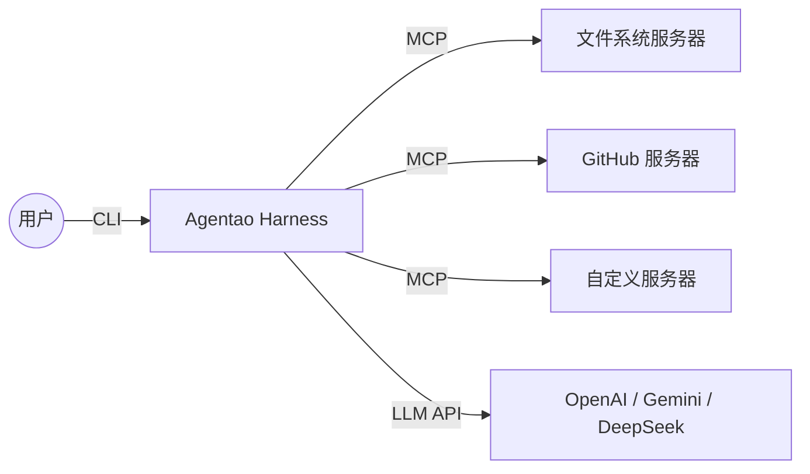

# Agentao（Agent + Tao）

```
   ___                      _
  / _ \ ___ _ ___  ___  ___| |_  ___  ___
 /  _  // _` / -_)| _ \/ _ \  _|/ _` / _ \
/_/ |_| \__, \___||_// \___/\__|\__,_\___/
        |___/        (The Way of Agents)
```

> **"秩序生于混沌，路径藏于智能。"**
>
> **Agentao** 是一个**治理优先的智能体运行时**，面向本地优先、私有优先、可嵌入的 AI Agents。
>
> 它帮助团队在本地或私有环境中，安全地构建、嵌入和扩展 AI Agents，并提供权限治理、协议接入、记忆、插件与多会话控制能力。
>
> *"道"代表规律、方法与路径——万物运行的底层结构。在 Agentao 中，"道"是让自治智能体保持安全、连接与可观测的无形秩序。`Agent Harness` 仍可作为解释运行时骨架的术语，但不再作为产品主定位。*

Agentao 基于 Python 构建，为开发者和团队提供一个可本地运行、可私有部署、可嵌入业务系统的智能体运行时，兼容任意 OpenAI 兼容接口。

---

## 30 行嵌入

把 `agentao` 嵌入 Python 宿主（FastAPI 路由、pytest fixture、Jupyter 内核、批
处理任务）是首要使用场景。下面这段代码构造一个 agent：**不读环境、不隐式联网、
不动全局状态**——所有输入由宿主显式提供。

```bash
pip install agentao
```

```python
from pathlib import Path
from agentao import Agentao
from agentao.llm import LLMClient
from agentao.transport import NullTransport

agent = Agentao(
    working_directory=Path("/tmp/agent-run-1"),
    llm_client=LLMClient(
        api_key="sk-...",
        base_url="https://api.openai.com/v1",
        model="gpt-5.4",
    ),
    transport=NullTransport(),
)
reply = agent.chat("Summarize today's logs.")
print(reply)
agent.close()
```

如果想保留 CLI 那种 `.env` / `~/.agentao/` / `<wd>/.agentao/*` 的环境自动发现，
改用 `agentao.embedding.build_from_environment(working_directory=...)`——CLI
内部就用它。完整嵌入契约见 [docs/EMBEDDING.md](docs/EMBEDDING.md)，公开 API
（`Agentao.events()`、`active_permissions()`、能力注入）见
[docs/api/harness.md](docs/api/harness.md)。

---

## CLI 快速开始

如果你想从终端交互式驱动 Agentao 而不是嵌入它，走 CLI 路径，3 分钟可跑起来：

1. 安装：

```bash
pip install agentao
```

2. 创建本地 `.env`。Agentao 启动时严格校验三个 provider 变量，缺任何一个都会立刻抛 `ValueError`：

```bash
printf "OPENAI_API_KEY=sk-your-key-here\nOPENAI_BASE_URL=https://api.openai.com/v1\nOPENAI_MODEL=gpt-5.4\n" > .env
```

3. 先用无 UI 模式验证：

```bash
agentao -p "Reply with the single word: OK"
```

预期输出：

```text
OK
```

4. 启动交互式会话：

```bash
agentao
```

如果启动失败，直接跳到[常见启动失败排查](#常见启动失败排查)或[故障排查](#故障排查)。

## 从这里开始

按你的目标选择阅读路径：

- 把 Agentao 嵌入你的 Python 项目：[30 行嵌入](#30-行嵌入) → [docs/EMBEDDING.md](docs/EMBEDDING.md) → [docs/api/harness.md](docs/api/harness.md)
- 第一次使用 Agentao（CLI）：[CLI 快速开始](#cli-快速开始) → [最小可运行配置](#最小可运行配置) → [使用方法](#使用方法)
- 只想先跑通最小配置：[安装](#安装) → [必需的环境变量](#必需的环境变量) → [最小可运行示例](#最小可运行示例)
- 想切换模型或 provider：[使用不同提供商](#使用不同提供商)
- 想接入 MCP：[MCP 服务器配置](#mcp-服务器配置) → [MCP（模型上下文协议）支持](#-mcp模型上下文协议支持)
- 想做插件、钩子或技能：[插件系统](#-插件系统) → [钩子系统（hooks-system）](#-钩子系统hooks-system) → [动态技能系统](#-动态技能系统)
- 想在代码里集成：[无 UI / SDK 集成](#无-ui--sdk-集成) → [ACP（Agent Client Protocol）模式](#acpagent-client-protocol模式)
- 想参与开发：[贡献者--源码安装](#贡献者--源码安装) → [开发](#开发) → [测试](#测试)

## 文档目录

### 用户使用

- [30 行嵌入](#30-行嵌入)
- [CLI 快速开始](#cli-快速开始)
- [从这里开始](#从这里开始)
- [第一次进入 CLI 常用命令](#第一次进入-cli-常用命令)
- [为什么选择 Agentao？](#为什么选择-agentao)
- [能力速览](#能力速览)
- [常见工作流](#常见工作流)
- [安装](#安装)
- [最小可运行配置](#最小可运行配置)
- [配置](#配置)
- [使用方法](#使用方法)
- [项目指令（AGENTAO.md）](#项目指令agentaomd)
- [故障排查](#故障排查)

### 贡献者

- [项目结构](#项目结构)
- [测试](#测试)
- [日志](#日志)
- [开发](#开发)
- [许可证](#许可证)

### 详细参考

- [核心能力](#核心能力)
- [设计原则](#设计原则)
- [词源（Etymology）](#词源etymology)
- [致谢](#致谢)

## 第一次进入 CLI 常用命令

对新手最常用的通常是这些：

```text
/help       查看可用命令
/status     查看 provider、model、token 使用和任务摘要
/model      列出或切换当前 provider 下的模型
/provider   列出或切换已配置的 provider
/todos      查看当前任务清单
/memory     查看或管理记忆
/mcp list   查看 MCP 服务器状态
```

## 为什么选择 Agentao？

大多数 Agent 框架给你原始能力。**Agentao 给你一个可治理的智能体运行时。**

名字本身就编码了设计哲学：*Agent*（能力）+ *Tao*（治理）。所有功能都围绕“治理优先的运行时”这一理念展开：

| 支柱 | 含义 | Agentao 的实现 |
|------|------|----------------|
| **Constraint（约束）** | 智能体不可未经允许擅自行动 | 工具确认机制 — Shell、Web 及破坏性操作均暂停等待人工审批 |
| **Connectivity（连接）** | 智能体必须能触达训练数据以外的世界 | MCP 协议 — 通过 stdio 或 SSE 无缝对接任意外部服务 |
| **Observability（可观测性）** | 智能体必须展示其工作过程 | 实时思考展示 + 完整日志记录 — 每一步推理和工具调用均可见 |

## 能力速览

如果你正在评估 Agentao，先看这一节；如果你只想尽快跑起来，直接跳到[安装](#安装)和[使用方法](#使用方法)。

| 方向 | 你会得到什么 | 下一步看哪里 |
|------|--------------|-------------|
| 治理 | 工具确认、权限模式、先读后断言、可见推理 | [权限模式（安全特性）](#权限模式安全特性) |
| 上下文 | 长会话 token 追踪、自动压缩、超长恢复 | [核心能力](#核心能力) |
| 记忆 | 基于 SQLite 的持久记忆与召回 | [核心能力](#核心能力) |
| 终端体验 | Rich 输出、结构化工具展示、任务清单 | [使用方法](#使用方法) |
| 扩展性 | MCP、插件、Hooks、动态技能 | [配置](#配置) |
| 运行时接入面 | CLI、非交互模式、SDK 嵌入、ACP、子智能体 | [使用方法](#使用方法) |

## 常见工作流

如果你还不确定该从哪里开始，可以直接按下面的目标走：

| 目标 | 建议阅读路径 | 可以马上尝试 |
|------|-------------|-------------|
| 第一次成功跑起来 | [CLI 快速开始](#cli-快速开始) → [最小可运行配置](#最小可运行配置) | `agentao -p "Reply with the single word: OK"` |
| 在真实项目里开始使用 | [启动智能体](#启动智能体) → [项目指令（AGENTAO.md）](#项目指令agentaomd) | `agentao` 然后 `/status` |
| 切换 provider 或模型 | [使用不同提供商](#使用不同提供商) → [命令列表](#命令列表) | `/provider` 然后 `/model` |
| 接入外部工具 | [MCP 服务器配置](#mcp-服务器配置) → [MCP（模型上下文协议）支持](#-mcp模型上下文协议支持) | 创建 `.agentao/mcp.json` 后执行 `/mcp list` |
| 扩展 Agent 能力 | [插件系统](#-插件系统) → [钩子系统（hooks-system）](#-钩子系统hooks-system) → [动态技能系统](#-动态技能系统) | `agentao skill list` |
| 参与代码贡献 | [贡献者 / 源码安装](#贡献者--源码安装) → [测试](#测试) → [开发](#开发) | `uv sync` 后运行测试 |

## 文档地图

README 负责主路径；当你需要更深入的说明时，可以直接跳到这些文档：

| 主题 | 文档 |
|------|------|
| 快速开始 | [docs/QUICKSTART.md](docs/QUICKSTART.md) |
| 命令速查 | [docs/QUICK_REFERENCE.md](docs/QUICK_REFERENCE.md) |
| 配置参考（所有 `.agentao/*` 文件、`.env`、`AGENTAO.md`） | [docs/CONFIGURATION.zh.md](docs/CONFIGURATION.zh.md) |
| ACP 服务端模式 | [docs/ACP.md](docs/ACP.md) |
| 日志说明 | [docs/LOGGING.md](docs/LOGGING.md) |
| 技能指南 | [docs/SKILLS_GUIDE.md](docs/SKILLS_GUIDE.md) |
| 记忆系统细节 | [docs/features/memory-management.md](docs/features/memory-management.md) |
| ACP 客户端细节 | [docs/features/acp-client.md](docs/features/acp-client.md) |
| ACP 嵌入式 API | [docs/features/acp-embedding.md](docs/features/acp-embedding.md) |
| Headless 运行时契约 | [docs/features/headless-runtime.md](docs/features/headless-runtime.md) |
| 会话回放 | [docs/features/session-replay.md](docs/features/session-replay.md) |
| macOS 沙箱 | [docs/features/macos-sandbox-exec.md](docs/features/macos-sandbox-exec.md) |
| 开发者指南 | [developer-guide/](developer-guide/)（在 `developer-guide/` 下执行 `npx vitepress dev` 本地预览） |
| 集成示例 | [examples/](examples/) — 五个可直接运行的蓝本（SaaS API、IDE 插件、工单分流、数据工作台、批量任务） |

**一行命令体验** — 安装后即可运行：

```bash
# 让 Agentao 分析当前目录
agentao -p "列出这里所有的 Python 文件，并概括每个文件的作用"
```

## 核心能力

这一节是详细能力参考。如果你是第一次使用，建议先看[安装](#安装)、[最小可运行配置](#最小可运行配置)和[使用方法](#使用方法)，跑通后再回来看这里。

### 🏛️ 自治治理（Autonomous Governance）

有原则的智能体，深思熟虑后再行动：

- 多轮对话，保持上下文
- 函数调用驱动工具执行
- 智能工具选择与调度
- **工具调用韧性** — 对轻微 malformed JSON 参数和近似工具名做轻量修复，并在消息回传给严格 LLM API 前清洗异常文本
- **工具确认机制** — Shell、Web 及破坏性记忆操作需用户审批；`web_fetch` 支持域名分级权限（白名单/黑名单/询问）
- **可靠性原则** — 系统提示词在每轮对话中强制要求"读取后再断言"、报告差异、区分事实与推断
- **操作规范** — 语气与风格规则、Shell 命令效率模式、工具并行调用、非交互式参数及"先解释后执行"安全规范
- **项目指令自动加载** — 启动时自动读取当前目录下的 `AGENTAO.md`
- **当前日期注入** — 以 `<system-reminder>` 方式注入每条用户消息，而非写入系统提示词，保持系统提示词跨轮次稳定，充分利用 prompt cache
- **实时思考展示** — 实时显示 LLM 推理过程与工具调用，带 Rule 分隔线
- **Shell 输出流式展示** — Shell 命令执行时实时打印 stdout
- **完整日志记录** — 所有 LLM 交互记录至 `agentao.log`
- **多行粘贴支持** — 粘贴多行文本时整体进入输入缓冲区（prompt_toolkit 原生支持）；Alt+Enter 插入换行，Enter 提交
- **斜杠命令 Tab 补全** — 输入 `/` 后按 Tab 弹出补全菜单

### 🧠 弹性上下文引擎（Elastic Context Engine）

Agentao 会自动管理长对话，尽量不让用户手动清理上下文。

从用户视角，最重要的是：

- `/status` 和 `/context` 能看到 token 使用情况
- 老历史会被压缩，而不是静默丢弃
- 最近轮次会保留原文，保证连续性
- 超大工具输出会先截断，避免把 prompt 撑爆
- 如果上下文超长，会先自动恢复和重试，再决定是否报错

默认上下文限制为 200K token，可通过环境变量 `AGENTAO_CONTEXT_TOKENS` 覆盖。

### 💾 SQLite 持久记忆

基于 SQLite 的持久化记忆系统会自动把相关上下文带回来，而且不需要向量数据库。

在 README 层面，知道这些就够了：

- 默认有两套记忆：项目级记忆和用户级记忆
- 持久记忆会一直保留，直到显式删除
- 会话摘要能帮助重启后的连续性
- 每轮会动态召回最相关的记忆，而不是固定塞一大段
- 中文召回使用 `jieba` 分词，并支持用户词典提升效果

推荐下一步：

- 快速上手：[docs/features/memory-quickstart.md](docs/features/memory-quickstart.md)
- 行为与实现细节：[docs/features/memory-management.md](docs/features/memory-management.md)

**保存记忆：**
```
❯ 记住这个项目使用 uv 进行包管理
❯ 把我的首选语言保存为 Python
```

**Skill Crystallization（技能蒸馏）：** `/crystallize suggest` 从当前会话采集结构化证据（工具调用、关键文件、工作流步骤、成果信号）并起草 `SKILL.md`；用 `/crystallize feedback <text>` 追加修改意见（或 `/crystallize revise` 交互式输入）驱动重写；`/crystallize refine` 结合 skill-creator 指南打磨写作风格；最终 `/crystallize create [name]` 写入 `skills/`（全局或项目作用域）并立即重新加载。推荐流程：`suggest` → `feedback`（可重复）→ `refine` → `create`。

### 💡 语义展示引擎

终端 UI 的目标不是炫技，而是在真实工作时保持可读。

实际效果主要体现在：

- 工具调用有语义化标题，而不是原始噪音
- 长输出会缓冲，并优先展示真正有用的尾部
- diff 和错误会被清楚突出
- warning 会合并，减少刷屏
- 子智能体和推理输出在视觉上保持区分

如果你需要更偏操作层的速查，用 [docs/QUICK_REFERENCE.md](docs/QUICK_REFERENCE.md)；日志细节见 [docs/LOGGING.md](docs/LOGGING.md)。

### ✅ 会话任务追踪

对于多步骤任务，Agentao 维护一个实时任务清单，LLM 在执行过程中持续更新：

```
/todos

Task List（2/4 已完成）:

  ✓ 读取现有代码            completed
  ✓ 设计新模块结构          completed
  ◉ 编写新模块              in_progress
  ○ 运行测试                pending
```

- **LLM 自主管理** — 处理复杂任务时，智能体调用 `todo_write` 创建清单，并在每步完成后更新状态（`pending` → `in_progress` → `completed`）
- **始终可见** — 当前任务列表注入系统提示词，LLM 随时掌握自身进度
- **会话级生命周期** — 执行 `/clear` 或 `/new` 时自动清空；不持久化到磁盘（不同于记忆）
- **`/status` 摘要** — 有任务时显示 `Task list: 2/4 completed`

### 🤖 子智能体系统

Agentao 可将任务委托给独立的子智能体，每个子智能体运行自己的 LLM 循环，具有范围化的工具集和轮次限制。灵感来自 [Gemini CLI](https://github.com/google-gemini/gemini-cli) 的"智能体即工具"模式。

**内置智能体：**
- `codebase-investigator` — 只读代码库探索（查找文件、搜索模式、分析结构）
- `generalist` — 通用智能体，可访问所有工具，适用于复杂多步任务

内置智能体默认关闭，以保持默认工具 schema 精简。可在项目的 `.agentao/settings.json` 中开启：

```json
{
  "agents": {
    "enable_builtin": true
  }
}
```

嵌入式宿主也可以向 `Agentao(...)` 或 `build_from_environment(...)` 传入 `enable_builtin_agents=True`。

**两种触发方式：**
1. **LLM 驱动** — 父 LLM 通过 `agent_codebase_investigator` / `agent_generalist` 工具决定委托；支持可选的 `run_in_background=true` 参数实现异步执行
2. **用户驱动** — `/agent <name> <task>` 前台运行，`/agent bg <name> <task>` 后台运行，`/agents` 查看实时仪表盘

**视觉边界** — 前台子智能体使用青色分隔线标记，与主智能体输出清晰区分：
```
──────────── ▶ [generalist]: 任务描述 ────────────
  ⚙ [generalist 1/20] read_file (src/main.py)
  ⚙ [generalist 2/20] run_shell_command (pytest)
──────── ◀ [generalist] 3 turns · 8 tool calls · ~4,200 tokens · 12s ────
```

**确认隔离：**
- 前台子智能体：确认对话框显示 `[agent_name] tool_name`，清楚标明是哪个子智能体在请求权限
- 后台子智能体：所有工具自动允许（后台线程不发起交互提示，避免干扰终端输入）

**父上下文注入** — 子智能体接收最近 10 条父消息作为上下文，以理解更宏观的任务背景

**取消传播** — 按下 Ctrl+C 会干净地停止当前智能体及正在进行的前台子智能体（二者共享同一 `CancellationToken`）。后台智能体不受影响，会独立运行至完成。

**后台完成推送** — 后台智能体完成时，父 LLM 会在下一轮开始时通过 `<system-reminder>` 消息自动收到通知，无需主动轮询 `check_background_agent`。

**自定义智能体：** 创建 `.agentao/agents/my-agent.md`，包含 YAML frontmatter（`name`、`description`、`tools`、`max_turns`）— 启动时自动发现。

### 🔌 MCP（模型上下文协议）支持

连接外部 MCP 工具服务器，动态扩展智能体能力。Agentao 作为枢纽，将你的 LLM 大脑与外部世界相连：



- **Stdio 传输** — 启动本地子进程（如 `npx @modelcontextprotocol/server-filesystem`）
- **SSE 传输** — 连接远程 HTTP/SSE 端点
- **自动发现** — 启动时发现工具并注册为 `mcp_{server}_{tool}`
- **确认机制** — 除非服务器标记为 `"trust": true`，否则 MCP 工具需用户确认
- **环境变量展开** — 配置值中支持 `$VAR` 和 `${VAR}` 语法
- **两级配置** — 项目级 `.agentao/mcp.json` 覆盖全局 `<home>/.agentao/mcp.json`

### 🧩 插件系统

Agentao 支持 **兼容 Claude Code 的插件系统**，用一个 `plugin.json` 清单打包扩展能力。

从 README 角度，你只需要知道插件可以提供：

- 技能与命令
- 子智能体定义
- MCP 服务器定义
- 生命周期钩子

插件来源按优先级从全局 → 项目 → 内联 `--plugin-dir` 加载。

大多数用户只会用到这些命令：

```bash
agentao plugin list
agentao plugin list --json
agentao skill list
agentao skill install owner/repo:path/to/skill        # monorepo 子目录
agentao skill install owner/repo:path/to/skill@main   # 锁定到分支 / tag / commit
agentao skill update --all
```

这里保留概览即可。和技能相关的实操建议直接看 [docs/SKILLS_GUIDE.md](docs/SKILLS_GUIDE.md)。

### 🪝 钩子系统（Hooks System）

钩子允许插件在提示词发送前后、工具调用前后等生命周期节点运行外部命令或注入上下文。

对大多数读者来说，知道这几点就够了：

- Agentao 支持 Claude Code hooks 的实用子集
- `command` hook 可运行外部命令
- `prompt` hook 可注入额外上下文
- 为兼容性，载荷使用 Claude Code 工具别名

如果你只是确认“有没有 hooks”，这一节已经足够；更细的事件矩阵和载荷契约不适合继续堆在 README 首页。

### 🎯 动态技能系统

技能从 `skills/` 自动发现，可按需激活，而且无需改 Python 代码。

常见方式有三种：

- 手动添加 `skills/<name>/SKILL.md`
- 用 `/crystallize suggest` 从当前会话生成草稿
- 用 `/crystallize feedback <text>` 或 `/crystallize refine` 迭代
- 用 `/crystallize create [name]` 写入并加载

常用命令：

```bash
agentao skill list
agentao skill install anthropics/skills:skills/pdf      # owner/repo:path
agentao skill install anthropics/skills:skills/pdf@main # 锁定 ref
agentao skill update my-skill
agentao skill remove my-skill
```

更完整的实操说明看 [docs/SKILLS_GUIDE.md](docs/SKILLS_GUIDE.md)。

### 🛠️ 完整工具集

Agentao 自带的工具面很广，但多数用户只需要先知道工具按这些类别组织：

- 文件操作：读、写、编辑、列目录
- 搜索与发现：glob、内容搜索
- Shell 与 Web 访问
- 任务追踪与记忆工具
- 子智能体与技能激活工具
- 动态发现的 MCP 工具

新手先看前面的[第一次进入 CLI 常用命令](#第一次进入-cli-常用命令)，完整斜杠命令参考看[命令列表](#命令列表)，更适合日常操作的速查表在 [docs/QUICK_REFERENCE.md](docs/QUICK_REFERENCE.md)。

### 📼 会话回放（Session Replay）

Agentao 可以把一次会话的完整运行时时间线 —— 轮次、工具调用、权限决策、流式 chunk、错误 —— 以追加写的 JSONL 形式记录到 `.agentao/replays/` 下。它和 `/sessions` 不一样：会话是用来"接着聊"的，回放记录的是"agent 当时究竟做了什么"，用于调试、审计和未来的协议级回放。

- **默认关闭。** 用 `/replay on` 开启，或在 `.agentao/settings.json` 中设置 `replay.enabled: true`。
- **每个 session 实例一个文件。** 每次 session 新生（`/clear`、`/new`、ACP `session/load`）都会生成新的 `instance_id`，回放文件不跨边界。
- **查看与清理** —— `/replay list` 列出所有实例，`/replay show <id>` 回放事件序列，`/replay tail <id> [n]` 看最近 N 条，`/replay prune` 按 `replay.max_instances`（默认 20）清理。
- **Schema 已导出，CI 强制对齐。** JSON Schema 位于 `agentao/replay/schema.py`，与磁盘格式发生漂移会导致 CI 失败。

完整事件参考与字段级脱敏选项见 [docs/features/session-replay.md](docs/features/session-replay.md)。

### 🛡️ macOS 沙箱（防御纵深）

在 macOS 上，Agentao 可以用 `sandbox-exec`（Apple Seatbelt）把每个 `run_shell_command` 子进程包起来，让用户**已经批准**的命令也无法越出工作区。沙箱与权限模式**正交**——它限制的是"被允许的命令实际能做什么"，而不是"是否允许"。

- **opt-in。** 默认关闭，避免破坏依赖网络的工作流（如 `npm install`、`git clone`）。
- **会话级开关。** `/sandbox on` / `/sandbox off` 仅作用于当前会话；要持久化请编辑 `.agentao/sandbox.json`。
- **可切换 profile。** `/sandbox profile <name>` 在 `agentao/sandbox/profiles/` 下的 `.sb` 模板间切换。
- **状态查看。** `/sandbox status` 显示当前 profile 与配置错误；`/sandbox profiles` 列出可用模板。
- **作用范围。** 仅 `run_shell_command` 被包装——其它工具运行在 agent 宿主进程内，继续依赖权限引擎。Linux / Windows 静默 disabled。

完整 profile schema 与威胁模型见 [docs/features/macos-sandbox-exec.md](docs/features/macos-sandbox-exec.md)。

### 🛰️ Headless 运行时

`agentao.acp_client.ACPManager` 是给嵌入宿主（工作流运行时、守护进程、调度器等）的 semver 稳定接入面，让你不再需要解析 CLI 输出来驱动项目本地的 ACP 服务器。

- **公开入口。** `prompt_once(name, prompt, ...)` 用于一次性 fire-and-forget 轮次；`send_prompt(...)` 用于长生命周期会话。两者在同一服务器已有活跃轮次时**不阻塞**——直接抛 `AcpClientError(code=SERVER_BUSY)`。
- **每服务器单活跃轮次。** 通过 per-server lock 实现；取消、超时、错误都会清理槽位。
- **非交互模式。** 设置 `interactive=False` 后，manager 会自动拒绝 `session/request_permission` 与 `_agentao.cn/ask_user`，而不是阻塞在 `WAITING_FOR_USER` —— 这是守护进程应有的默认行为。
- **稳定 import 根。** 仅 `from agentao.acp_client import ...` 被 semver 保证；子模块内部细节会随版本变化。

可运行的 smoke 例子见 [`examples/headless_worker.py`](examples/headless_worker.py)。完整契约——错误码、超时与等锁的语义区分、latched-interaction 行为——见 [docs/features/headless-runtime.md](docs/features/headless-runtime.md) 与 [docs/features/acp-embedding.md](docs/features/acp-embedding.md)。

---

## 设计原则

Agentao 围绕三个基础原则构建：

1. **极简（Minimalism）** — 零摩擦启动。`pip install agentao` 即可运行。无需数据库、无需复杂配置、无需云依赖。

2. **透明（Transparency）** — 没有黑盒。智能体的推理链实时展示。每一次 LLM 请求、工具调用和 token 消耗都记录在 `agentao.log` 中。你始终知道智能体在做什么、为什么这样做。

3. **完整（Integrity）** — 上下文永不静默丢失。对话历史通过 LLM 摘要压缩（而非粗暴截断），记忆召回确保相关上下文自动浮现。智能体在跨会话中维持连贯的世界模型。

---

## 安装

如果你的目标只是“先把 Agentao 跑起来”，这一节和[最小可运行配置](#最小可运行配置)一起看就够了。如果你是准备参与代码贡献，可以直接跳到[贡献者 / 源码安装](#贡献者--源码安装)。

### 前置条件

- Python 3.10 或更高版本
- API 密钥（OpenAI、Anthropic、Gemini、DeepSeek 或任意 OpenAI 兼容接口）

### 安装

```bash
pip install agentao
```

创建 `.env` 文件。Agentao 要求同时设置 `OPENAI_API_KEY`、`OPENAI_BASE_URL`、`OPENAI_MODEL` 三个变量：

```bash
printf "OPENAI_API_KEY=your-api-key-here\nOPENAI_BASE_URL=https://api.openai.com/v1\nOPENAI_MODEL=gpt-5.4\n" > .env
```

### 贡献者 / 源码安装

```bash
git clone https://github.com/jin-bo/agentao
cd agentao
uv sync
cp .env.example .env
```

---

## 最小可运行配置

从零开始让 Agentao 跑起来所需的一切。

推荐首次上手顺序：

1. 先确认 Python 版本。
2. 在 `.env` 中同时设置 `OPENAI_API_KEY`、`OPENAI_BASE_URL`、`OPENAI_MODEL`（三者均为必填）。
3. 运行最小示例。
4. 如果失败，再看下面的启动排查表。

### 支持的 Python 版本

| 版本 | 状态 |
|------|------|
| 3.10 | ✅ 支持 |
| 3.11 | ✅ 支持 |
| 3.12 | ✅ 支持 |
| < 3.10 | ❌ 不支持 |

安装前确认版本：

```bash
python --version   # 必须 ≥ 3.10
```

### 必需的环境变量

以下三个变量均为强制要求：

| 变量 | 是否必需 | 示例 |
|------|----------|------|
| `OPENAI_API_KEY` | **是** | `sk-...` |
| `OPENAI_BASE_URL` | **是** | `https://api.openai.com/v1` |
| `OPENAI_MODEL` | **是** | `gpt-5.4` |

三者缺一不可——任一缺失时 Agentao 在启动时立即抛 `ValueError`。最小 `.env` 文件：

```env
OPENAI_API_KEY=sk-your-key-here
OPENAI_BASE_URL=https://api.openai.com/v1
OPENAI_MODEL=gpt-5.4
```

在运行 `agentao` 的目录下创建：

```bash
printf "OPENAI_API_KEY=sk-your-key-here\nOPENAI_BASE_URL=https://api.openai.com/v1\nOPENAI_MODEL=gpt-5.4\n" > .env
```

> **说明：** Agentao 优先从*当前工作目录*加载 `.env`，其次回退到 `~/.env`，无需系统级配置。

### 默认 provider 行为

| 设置 | 默认值 | 覆盖方式 |
|------|--------|----------|
| Provider | `OPENAI` | `LLM_PROVIDER=ANTHROPIC` |
| API key | *（无默认，必须显式设置）* | `OPENAI_API_KEY=sk-...` |
| Base URL | *（无默认，必须显式设置）* | `OPENAI_BASE_URL=https://api.openai.com/v1` |
| 模型 | *（无默认，必须显式设置）* | `OPENAI_MODEL=gpt-5.4` |
| Temperature | `0.2` | `LLM_TEMPERATURE=0.7` |

每个 provider 读取自己的 `<NAME>_API_KEY`、`<NAME>_BASE_URL` 和 `<NAME>_MODEL`：

```env
# 改用 Anthropic Claude
LLM_PROVIDER=ANTHROPIC
ANTHROPIC_API_KEY=sk-ant-...
ANTHROPIC_MODEL=claude-sonnet-4-6
ANTHROPIC_BASE_URL=https://api.anthropic.com/v1
```

### 最小可运行示例

```bash
pip install agentao
printf "OPENAI_API_KEY=sk-your-key-here\nOPENAI_BASE_URL=https://api.openai.com/v1\nOPENAI_MODEL=gpt-5.4\n" > .env

# 无 UI 验证是否正常工作（响应后退出）
agentao -p "Reply with the single word: OK"
```

预期输出：

```
OK
```

确认可用后，启动交互式会话：

```bash
agentao
```

### 常见启动失败排查

| 现象 | 可能原因 | 解决方法 |
|------|----------|----------|
| `ValueError: Missing OPENAI_API_KEY` | API key 未设置 | 在 `.env` 中添加 `OPENAI_API_KEY=sk-...` |
| `ValueError: Missing OPENAI_BASE_URL` | Base URL 未设置 | 在 `.env` 中添加 `OPENAI_BASE_URL=https://api.openai.com/v1` |
| `ValueError: Missing OPENAI_MODEL` | 模型未设置 | 在 `.env` 中添加 `OPENAI_MODEL=gpt-5.4` |
| `AuthenticationError` | API key 无效 | 检查 `.env` 中的 key 值是否正确 |
| `NotFoundError: model not found` | 模型名与 provider 不匹配 | 确认该模型在你的 provider 下可用 |
| `APIConnectionError` | 网络/防火墙/代理问题 | 检查网络；如有代理请设置 `OPENAI_BASE_URL` |
| `command not found: agentao` | CLI 不在 PATH 中 | 确认安装成功；将 `~/.local/bin`（Linux/Mac）或 `Scripts\`（Windows）加入 `$PATH` |
| 启动后报 provider 错误 | `LLM_PROVIDER` 与 key 不匹配 | 确保 `LLM_PROVIDER` 与提供的 key 对应（如 `LLM_PROVIDER=OPENAI` 配 `OPENAI_API_KEY`） |
| 启动时 `ModuleNotFoundError` | 安装不完整 | 重新执行 `pip install agentao`；确认 Python 版本 ≥ 3.10 |
| `.env` 未加载 | 文件不在当前目录 | 在包含 `.env` 的目录中运行 `agentao`，或将其放到 `~/.env` |

---

## 配置

建议在第一次成功跑通之后再看这一节。对于大多数新手，先用下面的 `.env` 示例，再按需看[使用不同提供商](#使用不同提供商)就够了。

编辑 `.env`：

```env
# 必填：API 密钥
OPENAI_API_KEY=your-api-key-here

# 必填：API 端点 Base URL
OPENAI_BASE_URL=https://api.openai.com/v1

# 必填：模型名称（无默认值，必须显式设置）
OPENAI_MODEL=gpt-5.4

# 可选：上下文窗口 token 限制（默认：200000）
# AGENTAO_CONTEXT_TOKENS=200000
```

### MCP 服务器配置

在项目中创建 `.agentao/mcp.json`（或 `<home>/.agentao/mcp.json` 用于全局服务器）：

```json
{
  "mcpServers": {
    "filesystem": {
      "command": "npx",
      "args": ["-y", "@modelcontextprotocol/server-filesystem", "/path/to/dir"],
      "trust": true
    },
    "github": {
      "command": "npx",
      "args": ["-y", "@modelcontextprotocol/server-github"],
      "env": { "GITHUB_TOKEN": "$GITHUB_TOKEN" }
    },
    "remote-api": {
      "url": "https://api.example.com/sse",
      "headers": { "Authorization": "Bearer $API_KEY" },
      "timeout": 30
    }
  }
}
```

| 字段 | 说明 |
|------|------|
| `command` | Stdio 传输的可执行文件 |
| `args` | 命令行参数 |
| `env` | 额外环境变量（支持 `$VAR` / `${VAR}` 展开） |
| `cwd` | 子进程工作目录 |
| `url` | SSE 端点 URL |
| `headers` | SSE 传输的 HTTP 头 |
| `timeout` | 连接超时秒数（默认：60） |
| `trust` | 跳过此服务器工具的确认（默认：false） |

MCP 服务器在启动时自动连接。使用 `/mcp list` 查看状态。

### 使用不同提供商

Agentao 支持通过 `/provider` 在运行时切换提供商。在 `.env`（或 `~/.env`）中使用命名约定 `<NAME>_API_KEY`、`<NAME>_BASE_URL` 和 `<NAME>_MODEL` 添加各提供商的凭证。**三者均为必填**——任一缺失的 provider 不会出现在 `/provider` 列表中，也无法切换。

```env
# OpenAI（默认）
OPENAI_API_KEY=sk-...
OPENAI_BASE_URL=https://api.openai.com/v1
OPENAI_MODEL=gpt-5.4

# Gemini
GEMINI_API_KEY=...
GEMINI_BASE_URL=https://generativelanguage.googleapis.com/v1beta/openai/
GEMINI_MODEL=gemini-2.0-flash

# DeepSeek
DEEPSEEK_API_KEY=...
DEEPSEEK_BASE_URL=https://api.deepseek.com/v1
DEEPSEEK_MODEL=deepseek-chat
```

运行时切换：
```
/provider           # 列出已检测到的提供商
/provider GEMINI    # 切换到 Gemini
/model              # 查看新端点可用的模型
```

---

## 使用方法

这一节按使用方式组织：

- 交互式 CLI：[启动智能体](#启动智能体) 和 [命令列表](#命令列表)
- 一次性脚本调用：[非交互（打印）模式](#非交互打印模式)
- Python 嵌入：[无 UI / SDK 集成](#无-ui--sdk-集成)
- 编辑器或外部客户端接入：[ACP（Agent Client Protocol）模式](#acpagent-client-protocol模式)
- 项目本地 ACP 服务管理：[ACP 客户端 — 项目本地服务器管理](#acp-客户端--项目本地服务器管理)

### 启动智能体

```bash
agentao
```

如果这是第一次进入交互模式，建议先试 `/help`、`/status` 和 `/model`。

### 非交互（打印）模式

使用 `-p` / `--print` 发送单条提示词、获取纯文本响应并退出——无 UI，无确认提示。适用于脚本和管道。

```bash
# 基本用法
agentao -p "2+2 等于几？"

# 从 stdin 读取
echo "总结一下：hello world" | agentao -p

# 组合 -p 参数与 stdin（两者合并为一条提示词发送）
echo "一些上下文" | agentao -p "总结 stdin"

# 输出到文件
agentao -p "列出 3 个质数" > output.txt

# 在管道中使用
agentao -p "翻译成法语：早上好" | pbcopy
```

打印模式下所有工具自动确认（无交互提示）。成功退出码为 `0`，错误为 `1`。

### 无 UI / SDK 集成

在自己的 Python 代码中嵌入 Agentao，无需终端界面：

```python
from pathlib import Path
from agentao.embedding import build_from_environment
from agentao.transport import SdkTransport

events = []
transport = SdkTransport(
    on_event=events.append,              # 接收类型化的 AgentEvent
    confirm_tool=lambda n, d, a: True,   # 自动允许所有工具
)
# 工厂自动读 .env / .agentao/ 完成凭据与配置发现。
# 如需纯注入构造，请改用 Agentao(working_directory=, api_key=, base_url=, model=, transport=...)。
agent = build_from_environment(working_directory=Path.cwd(), transport=transport)
response = agent.chat("总结当前目录")
```

`SdkTransport` 接受四个可选回调：`on_event`、`confirm_tool`、`ask_user`、`on_max_iterations`。未设置的回调使用安全默认值（自动允许、ask_user 返回提示信息、超出最大迭代次数时停止）。

如需完全静默的无头模式，调用不带 transport 的 `build_from_environment(working_directory=...)` 即可——自动使用 `NullTransport`。需要纯注入构造（不读 `.env` / `.agentao/`）的嵌入式 host 可以直接调用 `Agentao(working_directory=..., api_key=..., base_url=..., model=..., transport=...)`；自 0.3.0 起 `working_directory=` 必传（不传会抛 `TypeError`），未提供 `llm_client=` 时这三个凭据字段也都必传。

完整的嵌入实践——能力注入（`FileSystem` / `ShellExecutor` / `MemoryStore` / `MCPRegistry`）、异步用法（`agent.arun(...)`）、可选的 `replay` / `sandbox` / `bg_store`，以及 0.2.15 → 0.3.0 迁移指南——请参阅 **[docs/EMBEDDING.md](docs/EMBEDDING.md)**。

宿主侧的稳定观察面在 `agentao.harness`：`agent.events()` 返回 `ToolLifecycleEvent` / `SubagentLifecycleEvent` / `PermissionDecisionEvent` 的异步迭代器；`agent.active_permissions()` 返回 JSON-safe 的 `ActivePermissions` 快照（含 `loaded_sources` provenance）。内部的 `AgentEvent` / `Transport.emit()` 信息更丰富但不保证版本稳定 —— 生产宿主请对齐 harness 合约。完整参考：**[docs/api/harness.md](docs/api/harness.md)**。

### ACP（Agent Client Protocol）模式

将 Agentao 作为 [ACP](https://github.com/zed-industries/agent-client-protocol) stdio JSON-RPC 服务器启动，让兼容 ACP 的客户端（如 Zed）将 Agentao 作为其智能体运行时驱动：

```bash
agentao --acp --stdio
# 或者，在控制台脚本不在 PATH 时：
python -m agentao --acp --stdio
```

服务器从 stdin 读取以换行分隔的 JSON-RPC 2.0 消息，将响应和 `session/update` 通知写入 stdout，将日志（以及任何遗留的 `print`）输出到 stderr。按 Ctrl-D 或关闭 stdin 即可干净退出。

**已支持的方法：** `initialize`、`session/new`、`session/prompt`、`session/cancel`、`session/load`。工具确认通过 server→client 的 `session/request_permission` 请求暴露给客户端，提供 `allow_once` / `allow_always` / `reject_once` / `reject_always` 四个选项。支持每个 session 注入独立的 `cwd` 与 `mcpServers`；多 session 的取消、权限、消息流均做了隔离。

**v1 限制：** 仅支持 stdio 传输；仅接受 `text` 与 `resource_link` 两种 content 块（image / audio / embedded resource 会被 `INVALID_PARAMS` 拒绝）；MCP 服务器仅限 stdio 与 sse（http capability 为 `false`）；ACP 层的 `fs/*` 与 `terminal/*` host 能力**不**做代理 —— 文件操作和 shell 命令始终在 session 自己的 `cwd` 下本地执行。

完整启动流程、方法对照表、capability 协商、带注释的 NDJSON 抓包、事件映射参考、故障排查与贡献者笔记参见 **[docs/ACP.md](docs/ACP.md)**。

### ACP 客户端 — 项目本地服务器管理

除了作为 ACP 服务器运行外，Agentao 还可以作为 ACP **客户端**——连接并管理项目本地的 ACP 服务器。这些外部代理进程通过 stdio 使用 JSON-RPC 2.0 + NDJSON 分帧通信。

**配置：** 在项目根目录创建 `.agentao/acp.json`：

```json
{
  "servers": {
    "planner": {
      "command": "node",
      "args": ["./agents/planner/index.js"],
      "env": { "LOG_LEVEL": "info" },
      "cwd": ".",
      "description": "规划代理",
      "autoStart": true
    },
    "reviewer": {
      "command": "python",
      "args": ["-m", "review_agent"],
      "cwd": "./agents/reviewer",
      "description": "代码审查代理",
      "autoStart": false,
      "requestTimeoutMs": 120000
    }
  }
}
```

**服务器生命周期：**

```
configured → starting → initializing → ready ↔ busy → stopping → stopped
                                         ↕
                                   waiting_for_user
```

**CLI 命令：**

| 命令 | 说明 |
|------|------|
| `/acp` | 所有服务器概览 |
| `/acp start <name>` | 启动服务器 |
| `/acp stop <name>` | 停止服务器 |
| `/acp restart <name>` | 重启服务器 |
| `/acp send <name> <msg>` | 发送提示（自动连接） |
| `/acp cancel <name>` | 取消当前轮次 |
| `/acp status <name>` | 详细状态 |
| `/acp logs <name> [n]` | 查看 stderr 输出（最近 n 行） |
| `/acp approve <name> <id>` | 批准权限请求 |
| `/acp reject <name> <id>` | 拒绝权限请求 |
| `/acp reply <name> <id> <text>` | 回复输入请求 |

**交互桥接：** 当 ACP 服务器需要用户输入（权限确认或自由文本）时，会发送通知，成为待处理交互。这些交互显示在收件箱和 `/acp status <name>` 中。

**扩展方法：** Agentao 公布了私有扩展 `_agentao.cn/ask_user`，用于向用户请求自由文本输入，支持比简单权限授予更丰富的服务器到用户交互。

**关键设计决策：**
- **仅项目级配置** — 无全局 `<home>/.agentao/acp.json`；ACP 服务器为项目级作用域
- **不自动发送** — 消息不会自动路由到 ACP 服务器，需使用 `/acp send` 显式发送
- **独立收件箱** — 服务器输出显示在 ACP 收件箱中，不进入主对话上下文
- **延迟初始化** — ACP 管理器在首次执行 `/acp` 命令时创建，而非启动时

完整配置参考、生命周期详情、交互桥接协议、诊断与故障排查指南参见 **[docs/features/acp-client.md](docs/features/acp-client.md)**。

### 命令列表

所有命令以 `/` 开头，输入 `/` 后按 **Tab** 自动补全。

如果你只需要新手最常用的一小部分命令，先看前面的[第一次进入 CLI 常用命令](#第一次进入-cli-常用命令)。下面这张表是完整参考。

| 命令 | 说明 |
|------|------|
| `/help` | 显示帮助信息 |
| `/clear` | 保存当前会话，清除对话历史与所有记忆，开始新会话 |
| `/new` | `/clear` 的别名 |
| `/status` | 显示消息数、模型、激活技能、记忆数量、上下文用量 |
| `/model` | 从配置的 API 端点获取并列出可用模型 |
| `/model <name>` | 切换到指定模型（如 `/model gpt-5.4`） |
| `/provider` | 列出可用提供商（从 `*_API_KEY` 环境变量检测） |
| `/provider <NAME>` | 切换到其他提供商（如 `/provider GEMINI`） |
| `/skills` | 列出可用和已激活的技能 |
| `/memory` | 列出所有已保存记忆 |
| `/memory user` | 查看用户级记忆（<home>/.agentao/memory.db） |
| `/memory project` | 查看项目级记忆（.agentao/memory.db） |
| `/memory session` | 查看当前会话摘要（session_summaries 表） |
| `/memory status` | 显示记忆条目数、会话大小及本次召回命中数 |
| `/memory search <query>` | 搜索记忆（搜索键、标签和值） |
| `/memory tag <tag>` | 按标签筛选记忆 |
| `/memory delete <key>` | 删除指定记忆 |
| `/memory clear` | 清空所有记忆（需确认） |
| `/crystallize suggest` | 分析会话（证据 + 记录）并起草可复用技能 |
| `/crystallize feedback <text>` | 追加修改意见并重写当前草稿 |
| `/crystallize revise` | 交互式输入修改意见并重写草稿 |
| `/crystallize refine` | 结合 skill-creator 指南打磨草稿 |
| `/crystallize status` | 查看待处理草稿状态（feedback + evidence 计数） |
| `/crystallize clear` | 清除当前待处理草稿 |
| `/crystallize create [name]` | 将技能草稿写入 skills/（提示输入名称和作用域） |
| `/mcp` | 列出 MCP 服务器状态和工具数量 |
| `/mcp add <name> <cmd\|url>` | 向项目配置添加 MCP 服务器 |
| `/mcp remove <name>` | 从项目配置移除 MCP 服务器 |
| `/context` | 显示当前上下文窗口用量（token 数及百分比） |
| `/context limit <n>` | 设置上下文窗口限制（如 `/context limit 100000`） |
| `/agent` | 列出可用子智能体 |
| `/agent list` | 同 `/agent` |
| `/agent <name> <task>` | 前台运行子智能体（带 ▶/◀ 视觉边界） |
| `/agent bg <name> <task>` | 后台运行子智能体（立即返回 agent ID） |
| `/agent dashboard` | 后台智能体实时仪表盘（自动刷新） |
| `/agent status` | 查看所有后台任务状态、耗时、统计 |
| `/agent status <id>` | 查看指定后台任务的完整结果或错误 |
| `/agents` | `/agent dashboard` 的简写 |
| `/mode` | 显示当前权限模式 |
| `/mode read-only` | 屏蔽所有写入和 Shell 工具 |
| `/mode workspace-write` | 允许文件写入和安全只读 Shell；Web 访问需确认（默认） |
| `/mode full-access` | 所有工具无需确认直接执行 |
| `/plan` | 进入 Plan 模式（LLM 调研并起草计划，不允许任何写入操作） |
| `/plan show` | 显示已保存的计划文件 |
| `/plan implement` | 退出 Plan 模式，恢复原权限，展示已保存的计划 |
| `/plan clear` | 归档并清除当前计划；退出 Plan 模式 |
| `/plan history` | 列出最近归档的计划 |
| `/copy` | 将最后一条 agent 响应以 Markdown 格式复制到剪贴板 |
| `/sessions` | 列出已保存的会话 |
| `/sessions resume <id>` | 恢复指定会话 |
| `/sessions delete <id>` | 删除指定会话 |
| `/sessions delete all` | 删除所有已保存的会话（需确认） |
| `/todos` | 显示当前会话任务清单（带状态图标） |
| `/tools` | 列出所有已注册工具及描述 |
| `/tools <name>` | 显示指定工具的参数 schema |
| `/exit` 或 `/quit` | 退出程序 |

### 权限模式（安全特性）

Agentao 通过三种命名权限模式控制工具是否自动执行或需要用户确认。使用 `/mode` 切换，配置持久化至 `.agentao/settings.json`，下次启动时自动恢复。

| 模式 | 行为 |
|------|------|
| `workspace-write` | **默认。** 文件写入（`write_file`、`replace`）和安全只读 Shell 命令（`git status/log/diff`、`ls`、`grep`、`cat` 等）自动执行。Web 访问（`web_fetch`、`web_search`）需确认。未知 Shell 命令需确认。危险指令（`rm -rf`、`sudo`）被阻断。 |
| `read-only` | 所有写入和 Shell 工具被屏蔽，仅允许只读工具（`read_file`、`glob`、`grep` 等）。 |
| `full-access` | 所有工具无需确认直接执行，适用于受信任的全自动工作流。 |

```
/mode                   （显示当前模式）
/mode workspace-write   （默认 — 文件写入 + 安全 Shell 自动执行）
/mode read-only         （屏蔽所有写入和 Shell）
/mode full-access       （允许所有工具）
```

**workspace-write 模式下仍需确认的工具：**
- `web_fetch` — 网络访问（含域名分级例外，见下表）
- `web_search` — 网络访问
- `run_shell_command` — 命令不在安全前缀白名单中时
- `mcp_*` — MCP 工具（除非服务器设置 `"trust": true`）

**`web_fetch` 域名分级权限：**

| 类别 | 域名 | 行为 |
|------|------|------|
| 白名单 | `.github.com`、`.docs.python.org`、`.wikipedia.org`、`r.jina.ai`、`.pypi.org`、`.readthedocs.io` | 自动允许 |
| 黑名单 | `localhost`、`127.0.0.1`、`0.0.0.0`、`169.254.169.254`、`.internal`、`.local`、`::1` | 自动拒绝（SSRF 防护） |
| 默认 | 不在上述列表中的域名 | 需要确认 |

通过 `.agentao/permissions.json` 自定义：
```json
{
  "rules": [
    {"tool": "web_fetch", "domain": {"allowlist": [".mycompany.com"]}, "action": "allow"},
    {"tool": "web_fetch", "domain": {"blocklist": [".sketchy.io"]}, "action": "deny"}
  ]
}
```

域名匹配规则：前缀点号（`.github.com`）= 后缀匹配；无点号（`r.jina.ai`）= 精确匹配。

**在确认提示中按 2（全部允许）**，会话临时升级为 full-access 模式（仅内存，不写入配置），本次会话剩余工具静默执行，下次启动仍使用最后一次 `/mode` 设置的模式。

### Plan 模式

Plan 模式是一种专为复杂任务设计的工作流：让 LLM **先调研、起草计划**，经你确认后再执行。

```
/plan                   （进入 Plan 模式 — 提示符变为 [plan]）
"规划如何重构日志模块"
                        （agent 读取文件，调用 plan_save → 获得 draft_id）
                        （agent 准备好后调用 plan_finalize(draft_id)）
                        "Execute this plan? [y/N]"
y                       （退出 Plan 模式，恢复权限，agent 开始实现）
```

**Plan 模式强制执行的限制：**
- 文件写入（`write_file`、`replace`）**被拒绝**
- 记忆写入（`save_memory`、`todo_write`）**被拒绝**
- 非白名单 Shell 命令**被拒绝**（防止意外副作用）
- 安全只读 Shell 命令（`git diff`、`ls`、`cat`、`grep` 等）**允许执行**
- Web 访问（`web_fetch`、`web_search`）与平时一样**需确认**
- 技能激活**允许**（技能仅修改系统提示词）

**模型工具** — `plan_save(content)` 和 `plan_finalize(draft_id)` 在 Plan 模式中作为工具提供给 agent。agent 调用 `plan_save` 保存草稿并获得 `draft_id`，再将该 `draft_id` 传给 `plan_finalize` 触发审批提示——确保你审批的正是你看到的那份草稿。

**Plan 模式预设优先于**任何自定义 `permissions.json` 规则 — 工作区对 `write_file` 的 `allow` 规则无法绕过 Plan 模式的限制。

**使用流程：**
1. `/plan` — 进入 Plan 模式；提示符变为 `[plan]`（洋红色）
2. 让 agent 规划任务 — 它会读取文件并输出结构化计划
3. agent 调用 `plan_save` 持久化草稿；审批提示仅在 `plan_finalize` 后出现
4. 在"Execute?"提示处按 `y` 执行，按 `n` 继续精修
5. `/plan implement` — 手动退出 Plan 模式并恢复原权限
6. `/plan clear` — 删除计划文件并退出 Plan 模式

**注意事项：**
- 进入 Plan 模式前的权限模式会被保存，`/plan implement` 时精确恢复
- Plan 模式期间 `/mode` 被屏蔽（请先用 `/plan implement` 退出）
- `/clear` 会自动重置 Plan 模式

**确认菜单按键（无需回车）：**
- **1** — 是，执行本次
- **2** — 本次会话全部允许（临时升级为 full-access）
- **3** 或 **Esc** — 取消

### 示例交互

**读取和分析文件：**
```
❯ 读取 main.py 并解释它的作用
❯ 搜索此目录中所有 Python 文件
❯ 查找代码库中所有 TODO 注释
```

**处理代码：**
```
❯ 创建一个名为 utils.py 的新 Python 文件，包含辅助函数
❯ 用改进版本替换 utils.py 中的旧函数
❯ 使用 pytest 运行测试
```

**Web 与搜索：**
```
❯ 抓取 https://example.com 的内容
❯ 搜索 Python 最佳实践
```

**记忆：**
```
❯ 记住我偏好缩进使用制表符而非空格
❯ 保存这个 API 端点 URL 供以后使用
❯ 你记得我的哪些偏好？
/memory status              （查看条目数、会话大小、召回命中数）
/memory user                （浏览 Profile 层记忆）
/memory project             （浏览 Project 层记忆）
```

**技能蒸馏：**
```
/crystallize suggest             （从当前会话起草技能）
/crystallize feedback <text>     （根据你的反馈重写草稿，可多次重复）
/crystallize revise              （交互式输入反馈）
/crystallize refine              （结合 skill-creator 指南打磨）
/crystallize status              （查看 feedback + evidence 计数）
/crystallize create [name]       （写入 skills/ 并重新加载）
```

**上下文管理：**
```
❯ /context                     （查看当前 token 用量）
❯ /context limit 100000        （设置更低的上下文限制）
❯ /status                      （查看记忆数量和上下文百分比）
```

**使用智能体：**
```
❯ 分析项目结构并找出所有 API 端点
     （LLM 可能自动委托给 codebase-investigator）
/agent codebase-investigator 查找项目中所有 TODO 注释
/agent generalist 将日志模块重构为结构化输出

/agent bg generalist 运行完整测试套件并总结失败项
/agents                        （实时仪表盘——智能体运行时自动刷新）
/agent status a1b2c3d4         （查看指定后台任务完整结果）
```

**使用 MCP 工具：**
```
/mcp list                   （查看已连接的服务器和工具）
/mcp add fs npx -y @modelcontextprotocol/server-filesystem /tmp
❯ 列出项目中所有文件     （LLM 可能使用 MCP 文件系统工具）
```

**任务追踪：**
```
❯ 将日志模块重构为结构化输出
     （LLM 自动创建任务清单并在执行中更新状态）
/todos                          （随时查看当前任务列表）
/status                         （显示"Task list: 3/5 completed"）
```

**使用技能：**
```
❯ 激活 pdf 技能帮我合并 PDF 文件
❯ 使用 xlsx 技能分析这个电子表格
```

**先规划再实现：**
```
/plan
"规划如何为 CLI 添加 /foo 命令"
                        （agent 读取文件，调用 plan_save，再调用 plan_finalize）
                        "Execute this plan? [y/N]" → y
                        （退出 Plan 模式，agent 开始实现）
/plan implement         （如果按了 n，手动退出）
/plan show              （随时查看已保存的计划）
/plan clear             （丢弃计划并退出 Plan 模式）
```

**复制输出：**
```
/copy                           （将最后一条响应以 Markdown 格式复制到剪贴板）
```

**查看工具：**
```
/tools                          （列出所有已注册工具）
/tools run_shell_command        （显示参数 schema）
/tools web_fetch                （查看接受哪些参数）
```

---

## 项目指令（AGENTAO.md）

当你希望“项目级规则、约定、工作流提示”在当前仓库的每次会话中自动加载时，使用 `AGENTAO.md`。

如果当前工作目录中存在 `AGENTAO.md`，Agentao 会自动加载项目专属指令。这是最强大的定制特性——指令注入在系统提示词的**顶部**，优先级高于任何内置的智能体规则。

在 `AGENTAO.md` 中定义：

- 代码风格与规范
- 项目结构与模式
- 开发工作流与测试方法
- 常用命令与最佳实践
- 可靠性规则（如要求智能体在声明代码库事实时引用文件和行号）

可以将它理解为项目专属的 `.cursorrules` 或 `CLAUDE.md`——用最轻量的方式给智能体注入深度项目上下文，无需修改任何代码。

---

## 项目结构

这一节主要面向贡献者，或想理解代码库组织方式的高级用户。

```
agentao/
├── main.py                  # 入口点
├── pyproject.toml           # 项目配置
├── .env                     # 配置文件（从 .env.example 创建）
├── .env.example             # 配置模板
├── AGENTAO.md               # 项目专属智能体指令
├── README.md                # 英文文档
├── README.zh.md             # 中文文档（本文件）
├── tests/                   # 测试文件
│   └── test_*.py            # 功能测试
├── docs/                    # 文档
│   ├── features/            # 功能文档
│   └── implementation/      # 技术实现细节
└── agentao/
    ├── agent.py             # 核心编排
    ├── session.py           # 会话保存 / 加载 / 列表
    ├── cancellation.py      # 协作式 CancellationToken（Ctrl+C 传播）
    ├── permissions.py       # PermissionEngine（模式、域名规则、白名单）
    ├── display.py           # Rich 主题与工具/事件渲染器
    ├── logging_utils.py     # agentao.log 文件日志初始化
    ├── tool_runner.py       # 薄壳——重新导出 runtime/ 各阶段
    ├── cli/                 # CLI 界面（Rich）— 拆分为子包
    │   ├── _globals.py      # Console、logger、主题
    │   ├── _utils.py        # 斜杠命令、补全器
    │   ├── app.py           # AgentaoCLI 类（初始化、REPL 循环）
    │   ├── transport.py     # Transport 协议回调
    │   ├── session.py       # 会话生命周期钩子
    │   ├── commands.py      # 斜杠命令处理器（含 /sandbox、/replay）
    │   ├── commands_ext.py  # 重型命令处理器（记忆、智能体）
    │   ├── entrypoints.py   # 入口点、解析器、初始化向导
    │   └── subcommands.py   # 技能/插件 CLI 子命令
    ├── runtime/             # 单轮流水线（从 ToolRunner 拆分）
    │   ├── chat_loop.py     # 外层 chat() 循环；迭代上限；轮末回放
    │   ├── llm_call.py      # 单次 LLM 往返 + 重试/恢复
    │   ├── turn.py          # PerTurnRuntime — 包装一次 LLM→工具循环
    │   ├── tool_planning.py # 工具调用规划（解析、去重、排序）
    │   ├── tool_executor.py # Phase-3 执行（权限、沙箱注入）
    │   └── tool_result_formatter.py  # 为下一轮 LLM 格式化工具结果
    ├── context_manager.py   # 上下文窗口管理 + Agentic RAG
    ├── transport/           # Transport 协议（运行时与 UI 解耦）
    │   ├── events.py        # AgentEvent + EventType
    │   ├── null.py          # NullTransport（无头 / 静默模式）
    │   ├── sdk.py           # SdkTransport + build_compat_transport
    │   └── base.py          # Transport Protocol 定义
    ├── prompts/             # 系统提示词组装
    │   ├── builder.py       # _build_system_prompt 入口
    │   ├── sections.py      # Identity、可靠性、Tone & Style 等子块
    │   └── helpers.py       # 日期注入、AGENTAO.md 加载
    ├── llm/
    │   └── client.py        # OpenAI 兼容 LLM 客户端
    ├── agents/
    │   ├── manager.py       # AgentManager — 加载定义，创建包装器
    │   ├── tools.py         # TaskComplete、CompleteTaskTool、AgentToolWrapper
    │   └── definitions/     # 内置智能体定义
    ├── plugins/             # 插件系统
    │   ├── manager.py       # 插件发现、加载、优先级
    │   ├── manifest.py      # plugin.json 解析器 + 路径安全检查
    │   ├── hooks.py         # 钩子分发、载荷适配器、工具别名
    │   ├── models.py        # 插件数据模型、支持的事件/类型
    │   ├── skills.py        # 插件技能解析 + 冲突检测
    │   ├── agents.py        # 插件智能体解析
    │   ├── mcp.py           # 插件 MCP 服务器合并
    │   └── diagnostics.py   # 插件诊断 + CLI 报告
    ├── plan/                # Plan 模式（controller、prompt、session 状态）
    ├── replay/              # 会话回放子系统
    │   ├── recorder.py      # 按 session/instance 追加写的 JSONL writer
    │   ├── reader.py        # 流式 / tail 读取回放文件
    │   ├── schema.py        # 导出的 JSON Schema（CI 检查 drift）
    │   ├── lifecycle.py     # 与会话生命周期联动的 start/end 钩子
    │   ├── retention.py     # 按 max_instances 清理
    │   ├── redact.py        # 字段级脱敏
    │   └── sanitize.py      # 工具参数 / 事件清洗
    ├── sandbox/             # macOS sandbox-exec 包装（opt-in）
    │   ├── policy.py        # SandboxPolicy.resolve(tool_name, args)
    │   └── profiles/        # 内置 .sb seatbelt 模板
    ├── acp/                 # ACP 服务端（Agentao 作为 Zed 等客户端的智能体）
    │   ├── server.py        # JSON-RPC stdio 主循环
    │   ├── session_manager.py  # 多 session 隔离
    │   ├── session_new.py / session_prompt.py / session_cancel.py / session_load.py
    │   ├── transport.py     # NDJSON 分帧
    │   └── mcp_translate.py # 每 session MCP 注入
    ├── acp_client/          # ACP 客户端管理器（Agentao 驱动外部服务器）
    │   ├── manager/         # ACPManager — 公开 API：prompt_once、send_prompt
    │   ├── client.py        # 单服务器 JSON-RPC 客户端
    │   ├── process.py       # 子进程生命周期
    │   ├── inbox.py         # 服务器输出收件箱
    │   ├── interaction.py   # 权限 / ask_user 桥接
    │   └── router.py        # 通知派发
    ├── mcp/
    │   ├── config.py        # 配置加载 + 环境变量展开
    │   ├── client.py        # McpClient + McpClientManager
    │   └── tool.py          # McpTool 包装器
    ├── memory/
    │   ├── manager.py       # SQLite 记忆管理器
    │   ├── models.py        # MemoryEntry、IndexEntry 数据类
    │   ├── retriever.py     # 基于索引的动态召回
    │   └── crystallizer.py  # 技能蒸馏
    ├── tooling/             # 跨切面的工具辅助（registry 适配器）
    ├── tools/
    │   ├── base.py          # Tool 基类 + 注册表
    │   ├── file_ops.py      # 读、写、编辑、列出
    │   ├── search.py        # Glob、grep
    │   ├── shell.py         # Shell 执行（沙箱感知）
    │   ├── web.py           # 抓取、搜索
    │   ├── memory.py        # 持久化记忆工具
    │   ├── skill.py         # 技能激活
    │   ├── ask_user.py      # 任务中途向用户提问
    │   └── todo.py          # 会话任务清单
    └── skills/
        ├── manager.py       # 技能加载与管理
        ├── registry.py      # 技能注册表（JSON 持久化）
        ├── installer.py     # 远程技能安装/更新
        └── sources.py       # GitHub 技能源
```

---

## 测试

在提交 PR 前，或修改了行为逻辑之后，建议先运行这里的检查。

```bash
# 运行所有测试（需要源码 checkout）
python -m pytest tests/ -v

# 运行特定测试文件
python -m pytest tests/test_context_manager.py -v
python -m pytest tests/test_memory_management.py -v
```

测试使用 `unittest.mock.Mock` 模拟 LLM 客户端——无需真实 API 调用。

---

## 日志

当你需要确认 agent、模型或工具在一次会话中到底做了什么时，看这一节。

所有 LLM 交互记录至 `agentao.log`：

```bash
tail -f agentao.log    # 实时监控
grep "ERROR" agentao.log
```

记录内容包括：完整消息内容、带参数的工具调用、工具结果、token 用量及时间戳。

---

## 开发

贡献者建议阅读顺序：

1. [贡献者 / 源码安装](#贡献者--源码安装)
2. [项目结构](#项目结构)
3. [测试](#测试)
4. 根据需要进入扩展指南：[添加工具](#添加工具)、[添加智能体](#添加智能体) 或 [添加技能](#添加技能)

这一节面向贡献者。如果你只是把 Agentao 当 CLI 使用，可以直接跳过。

### 添加工具

1. 在 `agentao/tools/` 中创建工具类：

```python
from .base import Tool

class MyTool(Tool):
    @property
    def name(self) -> str:
        return "my_tool"

    @property
    def description(self) -> str:
        return "LLM 使用的描述"

    @property
    def parameters(self) -> Dict[str, Any]:
        return {
            "type": "object",
            "properties": {
                "param": {"type": "string", "description": "..."}
            },
            "required": ["param"],
        }

    @property
    def requires_confirmation(self) -> bool:
        return False  # 危险操作设为 True

    def execute(self, param: str) -> str:
        return f"结果：{param}"
```

2. 在 `agent.py::_register_tools()` 中注册：

```python
tools_to_register.append(MyTool())
```

### 添加智能体

创建带 YAML frontmatter 的 Markdown 文件。内置智能体位于 `agentao/agents/definitions/`，需通过 `.agentao/settings.json` 显式开启；项目级智能体放在 `.agentao/agents/`，默认自动发现。

```yaml
---
name: my-agent
description: "何时使用此智能体（展示给 LLM 用于委托决策）"
tools:                    # 可选——省略则使用所有工具
  - read_file
  - search_file_content
max_turns: 10             # 可选，默认 15
---
你是一个专业智能体。子智能体的指令写在这里。
完成后调用 complete_task 返回结果。
```

重启 Agentao——智能体自动发现并注册为 `agent_my_agent` 工具。

### 添加技能

**方式 A：手动创建**

1. 创建 `skills/my-skill/SKILL.md`：

```yaml
---
name: my-skill
description: 使用场景（LLM 的触发条件）
---

# 我的技能

文档内容...
```

2. 重启 Agentao——技能自动发现。

**方式 B：从会话蒸馏**

```
/crystallize suggest             （LLM 基于本次会话的工具调用 + 记录起草技能）
/crystallize feedback <text>     （可选，可重复——根据你的反馈重写草稿）
/crystallize refine              （可选——结合 skill-creator 指南打磨写作风格）
/crystallize create [name]       （提示输入作用域，写入 SKILL.md，立即重新加载）
```

每次 `suggest` 都会在采集会话记录的同时抽取结构化证据（工具调用、关键文件、工作流步骤、成果信号），让草稿真正反映会话“做了什么”，而不仅是“聊了什么”。`feedback` / `revise` 就地更新待处理草稿；`status` 显示当前草稿的 evidence + feedback 计数；`clear` 丢弃草稿。

通过 `/crystallize create` 创建的技能写入 `.agentao/skills/`（项目作用域）或 `<home>/.agentao/skills/`（全局作用域），无需重启即可立即激活。

---

## 故障排查

这一节用于处理首次启动之外的问题，例如运行时行为、工具调用或集成问题。

如果你排查的是第一次启动失败，优先看前面的[常见启动失败排查](#常见启动失败排查)。

**模型列表加载失败：** `/model` 查询实时 API 端点。若失败（无效密钥、端点不可达、无 `models` 端点），会显示明确的错误信息。请检查 `OPENAI_API_KEY` 和 `OPENAI_BASE_URL` 设置。

**提供商列表为空：** `/provider` 只显示同时设置了 `*_API_KEY`、`*_BASE_URL` 和 `*_MODEL` 的提供商。确保三个变量都在 `~/.env` 中或已导出到 Shell——不要求项目目录中必须有 `.env`。

**API 密钥问题：** 确认 `.env` 存在并包含具有正确权限的有效密钥。

**上下文过长错误：** Agentao 通过三级恢复自动处理（压缩 → 最小历史 → 报错）。常见原因：工具结果非常大（如读取大文件）或对话极长。若错误持续，使用 `/context limit <n>` 或 `AGENTAO_CONTEXT_TOKENS` 降低限制。

**记忆未出现在响应中：** 运行 `/memory status` 查看条目数和召回命中计数是否在增加。召回器通过关键词重叠和时效性对条目评分；若查询与任何条目的标题、标签、关键词或内容没有共同 token，则不会召回任何内容。尝试换一种表达方式，或用 `/memory user` / `/memory project` 直接查看条目。注意：稳定块始终包含 user-scope 条目以及结构化的 project 类型（`decision` / `constraint` / `workflow` / `preference` / `profile`），与查询无关；只有 `project_fact` 和 `note` 才依赖每轮的召回评分（其中最近更新的 3 条仍会被无条件纳入）。

**MCP 服务器连接失败：** 运行 `/mcp list` 查看状态和错误信息。确认命令存在且可执行，或 SSE URL 可访问。查看 `agentao.log` 获取详细连接错误。

**工具执行错误：** 检查文件权限、路径正确性，以及 Shell 命令在你的操作系统上是否有效。

---

## 词源（Etymology）

**Agentao** = *Agent*（智能体）+ *Tao*（道）

**道（Dào）** 是中国哲学的基础概念，代表万物运行的自然秩序，包含三层含义：

- **法则（Laws）** — 约束和规范行为的规律
- **方法（Methods）** — 实现目标的路径与技术
- **路径（Paths）** — 事物流动与连接的通道

在本项目中，"道"凝炼了一个 Agent Harness 应当是什么：不仅是原始的能力引擎，更是一条让智能体得以**安全、透明、有目的地行动**的**纪律之路**。没有道的智能体力量强大却难以预测。Agentao 是让这种力量值得信赖的结构。

---

## 许可证

本项目为开源项目，欢迎自由使用和修改。

## 致谢

- 基于 [OpenAI Python SDK](https://github.com/openai/openai-python) 构建
- CLI 界面由 [Rich](https://github.com/Textualize/rich) 驱动
- 输入处理由 [prompt_toolkit](https://github.com/prompt-toolkit/python-prompt-toolkit) 驱动
- 可选增强网页抓取通过 [Crawl4AI](https://github.com/unclecode/crawl4ai)
- MCP 支持通过 [Model Context Protocol SDK](https://github.com/modelcontextprotocol/python-sdk)
- MCP 架构灵感来自 [Gemini CLI](https://github.com/google-gemini/gemini-cli)
- 灵感来自 [Claude Code](https://github.com/anthropics/claude-code)
