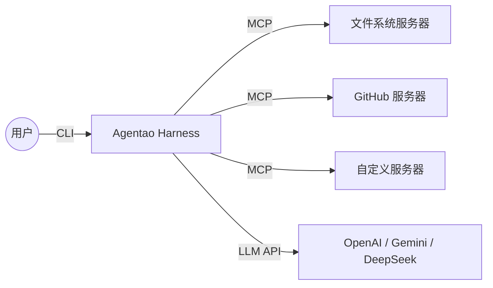

# Agentao（Agent + Tao）

```
   ___                      _
  / _ \ ___ _ ___  ___  ___| |_  ___  ___
 /  _  // _` / -_)| _ \/ _ \  _|/ _` / _ \
/_/ |_| \__, \___||_// \___/\__|\__,_\___/
        |___/        (The Way of Agents)
```

> **"秩序生于混沌，路径藏于智能。"**
>
> **Agentao** 是智能体的"运行之道"——一个受东方哲学启发、兼具严谨治理与灵动编排的 Agent Harness 工具。
>
> *"道"代表规律、方法与路径——万物运行的底层结构。在 Agentao 中，"道"是让自治智能体保持安全、连接与可观测的无形秩序。*

一款功能强大的 CLI 对话智能体框架，支持工具调用、技能扩展与 MCP 协议。基于 Python 构建，兼容任意 OpenAI 兼容接口。

---

## 为什么选择 Agentao？

大多数 Agent 框架给你能力。**Agentao 给你带有约束的能力。**

名字本身就编码了设计哲学：*Agent*（能力）+ *Tao*（治理）。所有功能都围绕 Harness 哲学的三大支柱构建：

| 支柱 | 含义 | Agentao 的实现 |
|------|------|----------------|
| **Constraint（约束）** | 智能体不可未经允许擅自行动 | 工具确认机制 — Shell、Web 及破坏性操作均暂停等待人工审批 |
| **Connectivity（连接）** | 智能体必须能触达训练数据以外的世界 | MCP 协议 — 通过 stdio 或 SSE 无缝对接任意外部服务 |
| **Observability（可观测性）** | 智能体必须展示其工作过程 | 实时思考展示 + 完整日志记录 — 每一步推理和工具调用均可见 |

**一行命令体验** — 安装后即可运行：

```bash
# 让 Agentao 分析当前目录
agentao -p "列出这里所有的 Python 文件，并概括每个文件的作用"
```

---

## 核心能力

### 🏛️ 自治治理（Autonomous Governance）

有原则的智能体，深思熟虑后再行动：

- 多轮对话，保持上下文
- 函数调用驱动工具执行
- 智能工具选择与调度
- **工具确认机制** — Shell、Web 及破坏性记忆操作需用户审批
- **可靠性原则** — 系统提示词在每轮对话中强制要求"读取后再断言"、报告差异、区分事实与推断
- **操作规范** — 语气与风格规则、Shell 命令效率模式、工具并行调用、非交互式参数及"先解释后执行"安全规范
- **项目指令自动加载** — 启动时自动读取当前目录下的 `AGENTAO.md`
- **当前日期注入** — 以 `<system-reminder>` 方式注入每条用户消息，而非写入系统提示词，保持系统提示词跨轮次稳定，充分利用 prompt cache
- **实时思考展示** — 实时显示 LLM 推理过程与工具调用，带 Rule 分隔线
- **Shell 输出流式展示** — Shell 命令执行时实时打印 stdout
- **完整日志记录** — 所有 LLM 交互记录至 `agentao.log`
- **多行粘贴支持** — 粘贴多行文本时整体进入输入缓冲区（prompt_toolkit 原生支持）；Alt+Enter 插入换行，Enter 提交
- **斜杠命令 Tab 补全** — 输入 `/` 后按 Tab 弹出补全菜单

### 🧠 弹性上下文引擎（Elastic Context Engine）

Agentao 自动管理长对话，以保持在 LLM 上下文限制内：

- **三层 Token 计数** — ① 每次 LLM 调用后从 provider API 响应中读取真实 `prompt_tokens`（最优）；② provider `count_tokens` API（次优，扩展点）；③ 本地估算兜底：支持 tiktoken（GPT-4 / Claude / DeepSeek 系列），回退时使用 CJK 感知字符扫描（ASCII = 0.25 tok/字符，非 ASCII = 1.3 tok/字符，参考 [gemini-cli](https://github.com/google-gemini/gemini-cli) 实现）。安装 tiktoken：`uv sync --extra tokenizer`
- **Token 分项上报** — `/status` 展示上下文按组件拆分：系统提示词 / 对话消息 / 工具 Schema，以及本次会话累计 prompt 和 completion token 用量
- **两级压缩** — 用量达 55% 时触发*微压缩*，无需 LLM 调用，直接截断旧的超大工具结果；达 65% 时触发完整 LLM 摘要压缩，将早期消息替换为结构化的 `[Conversation Summary]` 块
- **结构化 9 节摘要** — LLM 摘要生成涵盖：任务意图、关键技术概念、涉及文件、错误与修复、问题解决、用户消息、待办任务、当前状态和下一步行动——完整保留对话连贯性
- **部分压缩** — 保留最近 20 条消息原文；分割点前进至下一个 `user` 轮次边界，确保工具调用序列不被截断
- **边界标记 + 文件提示** — 压缩历史前置 `[Compact Boundary]` 标记和最近读取的文件列表，供智能体按需重读
- **固定消息** — 以 `[PIN]` 开头的消息始终原文保留，不参与摘要
- **熔断器** — 连续压缩失败 3 次后自动禁用压缩，避免无限重试循环（`/context` 显示失败次数）
- **工具结果截断** — 超过 80K 字符（约 20K token）的工具输出在加入消息前被截断
- **自动保存摘要** — 压缩摘要以 `conversation_summary` 标签保存至记忆，供未来参考
- **优雅降级** — 压缩失败时保留原始消息不变
- **三级溢出恢复** — 当 API 返回上下文过长错误时：① 强制压缩后重试；② 仍过长则仅保留最后 2 条消息后重试；③ 三级均失败才向用户报错

默认上下文限制为 200K token，可通过环境变量 `AGENTAO_CONTEXT_TOKENS` 覆盖。

### 💾 认知共鸣（Cognitive Resonance）

*无需向量数据库的 Agentic RAG* — 相关记忆在每次响应前自动浮现：

1. 将所有已保存的记忆列表发送给 LLM
2. LLM 返回相关记忆键的 JSON 数组
3. 展示召回的记忆并询问是否注入（单键确认）
4. 确认后，将记忆添加到本轮系统提示词中

你保存的重要上下文（偏好、事实、项目细节）会在相关时自动共鸣回来——无需主动检索。

### 💡 语义展示引擎

终端使用 Rich 格式提供简洁、低干扰的工具执行输出：

```
→ read  src/agent.py             ← 快速且无输出：仅显示标题行，无完成脚注

$ pytest tests/ -q
  ...........
  … +42 lines
✓ $ pytest tests/ -q  3.1s      ← 耗时 ≥ 2s：显示完成脚注

← edit  src/agent.py
  --- a/agent.py
  +++ b/agent.py
  @@ -12,3 +12,4 @@
  -old line
  +new line
✓ edit  src/agent.py  12ms      ← 显示了 diff：显示完成脚注

$ pandoc doc.md -o doc.pdf
  [warning] Missing character: 'X'
  … +14 similar warnings         ← 合并同类 warning
✓ $ pandoc …  1.8s
```

- **语义工具标题** — 每次工具调用以有意义的图标和参数预览渲染：`→ read`  `← edit`  `$ shell`  `✱ search`  `↗ fetch`  `◈ remember`
- **缓冲输出** — 所有输出（含 Shell）均缓冲后在完成时展示；防止刷屏，正确处理 `\r` 进度条、ANSI 颜色码和 `\r\n` 行尾
- **尾部优先截断** — 长输出展示最后 8 行，超出部分折叠为 `… +N lines`；错误和结果通常在尾部，始终可见
- **展开/折叠** — Shell 命令展示缓冲输出；读取/搜索/记忆工具默认折叠；折叠工具发生错误时，尾部输出自动浮现
- **Diff 渲染** — `replace` 展示彩色 unified diff；`write_file` 展示语法高亮内容预览（前 16 行，自动检测文件类型）
- **工具聚合** — 同一 LLM 轮次中并行调用的工具以 `  + header` 前缀标记，清楚呈现批量执行
- **进度计时器** — 工具运行超过 0.5 秒后，进度条更新为 `tool  0.8s`
- **条件性完成脚注** — 仅在有输出、有 diff、有错误或耗时 ≥ 2 s 时显示；快速且无输出的工具只显示标题行：`✓ read  32ms`  /  `✗ run_shell_command  1.2s  Permission denied`
- **Warning 合并** — Shell 输出中连续出现的同类警告折叠为一条摘要：`… +N similar warnings`
- **子智能体生命周期** — 前台子智能体用青色 `▶`/`◀` 分隔线包裹；完成时展示统计信息
- **思考展示** — LLM 推理以暗淡斜体风格展示在分隔线下
- **结构化推理** — 每组工具调用前，智能体打印其**行动**、**预期**和**若有偏差**的计划——可与实际工具结果核对的可证伪预测

### ✅ 会话任务追踪

对于多步骤任务，Agentao 维护一个实时任务清单，LLM 在执行过程中持续更新：

```
/todos

Task List（2/4 已完成）:

  ✓ 读取现有代码            completed
  ✓ 设计新模块结构          completed
  ◉ 编写新模块              in_progress
  ○ 运行测试                pending
```

- **LLM 自主管理** — 处理复杂任务时，智能体调用 `todo_write` 创建清单，并在每步完成后更新状态（`pending` → `in_progress` → `completed`）
- **始终可见** — 当前任务列表注入系统提示词，LLM 随时掌握自身进度
- **会话级生命周期** — 执行 `/clear` 或 `/new` 时自动清空；不持久化到磁盘（不同于记忆）
- **`/status` 摘要** — 有任务时显示 `Task list: 2/4 completed`

### 🤖 子智能体系统

Agentao 可将任务委托给独立的子智能体，每个子智能体运行自己的 LLM 循环，具有范围化的工具集和轮次限制。灵感来自 [Gemini CLI](https://github.com/google-gemini/gemini-cli) 的"智能体即工具"模式。

**内置智能体：**
- `codebase-investigator` — 只读代码库探索（查找文件、搜索模式、分析结构）
- `generalist` — 通用智能体，可访问所有工具，适用于复杂多步任务

**两种触发方式：**
1. **LLM 驱动** — 父 LLM 通过 `agent_codebase_investigator` / `agent_generalist` 工具决定委托；支持可选的 `run_in_background=true` 参数实现异步执行
2. **用户驱动** — `/agent <name> <task>` 前台运行，`/agent bg <name> <task>` 后台运行，`/agents` 查看实时仪表盘

**视觉边界** — 前台子智能体使用青色分隔线标记，与主智能体输出清晰区分：
```
──────────── ▶ [generalist]: 任务描述 ────────────
  ⚙ [generalist 1/20] read_file (src/main.py)
  ⚙ [generalist 2/20] run_shell_command (pytest)
──────── ◀ [generalist] 3 turns · 8 tool calls · ~4,200 tokens · 12s ────
```

**确认隔离：**
- 前台子智能体：确认对话框显示 `[agent_name] tool_name`，清楚标明是哪个子智能体在请求权限
- 后台子智能体：所有工具自动允许（后台线程不发起交互提示，避免干扰终端输入）

**父上下文注入** — 子智能体接收最近 10 条父消息作为上下文，以理解更宏观的任务背景

**取消传播** — 按下 Ctrl+C 会干净地停止当前智能体及正在进行的前台子智能体（二者共享同一 `CancellationToken`）。后台智能体不受影响，会独立运行至完成。

**后台完成推送** — 后台智能体完成时，父 LLM 会在下一轮开始时通过 `<system-reminder>` 消息自动收到通知，无需主动轮询 `check_background_agent`。

**自定义智能体：** 创建 `.agentao/agents/my-agent.md`，包含 YAML frontmatter（`name`、`description`、`tools`、`max_turns`）— 启动时自动发现。

### 🔌 MCP（模型上下文协议）支持

连接外部 MCP 工具服务器，动态扩展智能体能力。Agentao 作为枢纽，将你的 LLM 大脑与外部世界相连：



- **Stdio 传输** — 启动本地子进程（如 `npx @modelcontextprotocol/server-filesystem`）
- **SSE 传输** — 连接远程 HTTP/SSE 端点
- **自动发现** — 启动时发现工具并注册为 `mcp_{server}_{tool}`
- **确认机制** — 除非服务器标记为 `"trust": true`，否则 MCP 工具需用户确认
- **环境变量展开** — 配置值中支持 `$VAR` 和 `${VAR}` 语法
- **两级配置** — 项目级 `.agentao/mcp.json` 覆盖全局 `~/.agentao/mcp.json`

### 🎯 动态技能系统

技能从 `skills/` 目录自动发现。每个子目录包含带 YAML frontmatter 的 `SKILL.md` 文件。技能列于系统提示词中，可通过 `activate_skill` 工具激活。

创建包含 `SKILL.md` 的目录即可添加新技能——无需修改代码。

### 🛠️ 完整工具集

**文件操作：**
- `read_file` — 读取文件内容
- `write_file` — 写入文件（需确认）
- `replace` — 通过文本替换编辑文件
- `list_directory` — 列出目录内容

**搜索与发现：**
- `glob` — 按模式查找文件（支持 `**` 递归搜索）
- `search_file_content` — 支持正则的文件内容搜索

**Shell 与 Web：**
- `run_shell_command` — 执行 Shell 命令（需确认）
- `web_fetch` — 抓取并提取 URL 内容（需确认）；若已安装 [Crawl4AI](https://github.com/unclecode/crawl4ai) 则输出干净的 Markdown，否则回退为纯文本提取
- `google_web_search` — 通过 DuckDuckGo 搜索（需确认）

**任务追踪：**
- `todo_write` — 更新会话任务清单（pending → in_progress → completed）；使用 `/todos` 查看

**智能体与技能：**
- `agent_codebase_investigator` — 将只读代码库探索委托给子智能体（支持 `run_in_background`）
- `agent_generalist` — 将复杂多步任务委托给通用子智能体（支持 `run_in_background`）
- `check_background_agent` — 按 ID 查询后台子智能体状态；传空字符串列出所有任务
- `activate_skill` — 激活特定任务的专用技能
- `ask_user` — 任务执行中途暂停并向用户提问

**MCP 工具：**
- 从已连接的 MCP 服务器动态发现
- 命名规则：`mcp_{server}_{tool}`（如 `mcp_filesystem_read_file`）
- 除非服务器设置为信任，否则需要用户确认

---

## 设计原则

Agentao 围绕三个基础原则构建：

1. **极简（Minimalism）** — 零摩擦启动。`uv sync` 即可运行。无需数据库、无需复杂配置、无需云依赖。

2. **透明（Transparency）** — 没有黑盒。智能体的推理链实时展示。每一次 LLM 请求、工具调用和 token 消耗都记录在 `agentao.log` 中。你始终知道智能体在做什么、为什么这样做。

3. **完整（Integrity）** — 上下文永不静默丢失。对话历史通过 LLM 摘要压缩（而非粗暴截断），记忆召回确保相关上下文自动浮现。智能体在跨会话中维持连贯的世界模型。

---

## 安装

### 前置条件

- Python 3.12 或更高版本
- [uv](https://github.com/astral-sh/uv)（推荐）或 pip
- OpenAI API 密钥或可访问的 OpenAI 兼容接口

### 使用 uv 快速开始（推荐）

```bash
curl -LsSf https://astral.sh/uv/install.sh | sh
```

然后配置 Agentao：

```bash
cd agentao
uv sync
cp .env.example .env
# 编辑 .env，填入你的 API 密钥
```

### 替代方案：pip

```bash
python3 -m venv .venv
source .venv/bin/activate  # Windows: .venv\Scripts\activate
pip install -e .
cp .env.example .env
```

---

## 配置

编辑 `.env`：

```env
# 必填：API 密钥
OPENAI_API_KEY=your-api-key-here

# 可选：OpenAI 兼容接口的 Base URL
# OPENAI_BASE_URL=https://api.openai.com/v1

# 可选：模型名称
# OPENAI_MODEL=gpt-4-turbo-preview

# 可选：上下文窗口 token 限制（默认：200000）
# AGENTAO_CONTEXT_TOKENS=200000
```

### MCP 服务器配置

在项目中创建 `.agentao/mcp.json`（或 `~/.agentao/mcp.json` 用于全局服务器）：

```json
{
  "mcpServers": {
    "filesystem": {
      "command": "npx",
      "args": ["-y", "@modelcontextprotocol/server-filesystem", "/path/to/dir"],
      "trust": true
    },
    "github": {
      "command": "npx",
      "args": ["-y", "@modelcontextprotocol/server-github"],
      "env": { "GITHUB_TOKEN": "$GITHUB_TOKEN" }
    },
    "remote-api": {
      "url": "https://api.example.com/sse",
      "headers": { "Authorization": "Bearer $API_KEY" },
      "timeout": 30
    }
  }
}
```

| 字段 | 说明 |
|------|------|
| `command` | Stdio 传输的可执行文件 |
| `args` | 命令行参数 |
| `env` | 额外环境变量（支持 `$VAR` / `${VAR}` 展开） |
| `cwd` | 子进程工作目录 |
| `url` | SSE 端点 URL |
| `headers` | SSE 传输的 HTTP 头 |
| `timeout` | 连接超时秒数（默认：60） |
| `trust` | 跳过此服务器工具的确认（默认：false） |

MCP 服务器在启动时自动连接。使用 `/mcp list` 查看状态。

### 使用不同提供商

Agentao 支持通过 `/provider` 在运行时切换提供商。在 `.env`（或 `~/.env`）中使用命名约定 `<NAME>_API_KEY`、`<NAME>_BASE_URL` 和 `<NAME>_MODEL` 添加各提供商的凭证：

```env
# OpenAI（默认）
OPENAI_API_KEY=sk-...
OPENAI_MODEL=gpt-4-turbo-preview

# Gemini
GEMINI_API_KEY=...
GEMINI_BASE_URL=https://generativelanguage.googleapis.com/v1beta/openai/
GEMINI_MODEL=gemini-2.0-flash

# DeepSeek
DEEPSEEK_API_KEY=...
DEEPSEEK_BASE_URL=https://api.deepseek.com/v1
DEEPSEEK_MODEL=deepseek-chat
```

运行时切换：
```
/provider           # 列出已检测到的提供商
/provider GEMINI    # 切换到 Gemini
/model              # 查看新端点可用的模型
```

---

## 使用方法

### 启动智能体

```bash
# 快速启动
uv run agentao

# 通过 Python
uv run python main.py

# 通过便捷脚本
./run.sh
```

### 非交互（打印）模式

使用 `-p` / `--print` 发送单条提示词、获取纯文本响应并退出——无 UI，无确认提示。适用于脚本和管道。

```bash
# 基本用法
agentao -p "2+2 等于几？"

# 从 stdin 读取
echo "总结一下：hello world" | agentao -p

# 组合 -p 参数与 stdin（两者合并为一条提示词发送）
echo "一些上下文" | agentao -p "总结 stdin"

# 输出到文件
agentao -p "列出 3 个质数" > output.txt

# 在管道中使用
agentao -p "翻译成法语：早上好" | pbcopy
```

打印模式下所有工具自动确认（无交互提示）。成功退出码为 `0`，错误为 `1`。

### 无 UI / SDK 集成

在自己的 Python 代码中嵌入 Agentao，无需终端界面：

```python
from agentao import Agentao
from agentao.transport import SdkTransport

events = []
transport = SdkTransport(
    on_event=events.append,              # 接收类型化的 AgentEvent
    confirm_tool=lambda n, d, a: True,   # 自动允许所有工具
)
agent = Agentao(transport=transport)
response = agent.chat("总结当前目录")
```

`SdkTransport` 接受四个可选回调：`on_event`、`confirm_tool`、`ask_user`、`on_max_iterations`。未设置的回调使用安全默认值（自动允许、ask_user 返回提示信息、超出最大迭代次数时停止）。

如需完全静默的无头模式，直接 `Agentao()` 即可——自动使用 `NullTransport`。

### 命令列表

所有命令以 `/` 开头，输入 `/` 后按 **Tab** 自动补全。

| 命令 | 说明 |
|------|------|
| `/help` | 显示帮助信息 |
| `/clear` | 保存当前会话，清除对话历史与所有记忆，开始新会话 |
| `/new` | `/clear` 的别名 |
| `/status` | 显示消息数、模型、激活技能、记忆数量、上下文用量 |
| `/model` | 从配置的 API 端点获取并列出可用模型 |
| `/model <name>` | 切换到指定模型（如 `/model gpt-4`） |
| `/provider` | 列出可用提供商（从 `*_API_KEY` 环境变量检测） |
| `/provider <NAME>` | 切换到其他提供商（如 `/provider GEMINI`） |
| `/skills` | 列出可用和已激活的技能 |
| `/memory` | 列出所有已保存记忆及标签摘要 |
| `/memory search <query>` | 搜索记忆（搜索键、标签和值） |
| `/memory tag <tag>` | 按标签筛选记忆 |
| `/memory delete <key>` | 删除指定记忆 |
| `/memory clear` | 清空所有记忆（需确认） |
| `/mcp` | 列出 MCP 服务器状态和工具数量 |
| `/mcp add <name> <cmd\|url>` | 向项目配置添加 MCP 服务器 |
| `/mcp remove <name>` | 从项目配置移除 MCP 服务器 |
| `/context` | 显示当前上下文窗口用量（token 数及百分比） |
| `/context limit <n>` | 设置上下文窗口限制（如 `/context limit 100000`） |
| `/agent` | 列出可用子智能体 |
| `/agent list` | 同 `/agent` |
| `/agent <name> <task>` | 前台运行子智能体（带 ▶/◀ 视觉边界） |
| `/agent bg <name> <task>` | 后台运行子智能体（立即返回 agent ID） |
| `/agent dashboard` | 后台智能体实时仪表盘（自动刷新） |
| `/agent status` | 查看所有后台任务状态、耗时、统计 |
| `/agent status <id>` | 查看指定后台任务的完整结果或错误 |
| `/agents` | `/agent dashboard` 的简写 |
| `/confirm` | 显示当前工具确认模式 |
| `/confirm all` | 启用全允许模式（工具无需提示直接执行） |
| `/confirm prompt` | 恢复提示模式（每次工具调用前询问） |
| `/sessions` | 列出已保存的会话 |
| `/sessions resume <id>` | 恢复指定会话 |
| `/sessions delete <id>` | 删除指定会话 |
| `/sessions delete all` | 删除所有已保存的会话（需确认） |
| `/todos` | 显示当前会话任务清单（带状态图标） |
| `/tools` | 列出所有已注册工具及描述 |
| `/tools <name>` | 显示指定工具的参数 schema |
| `/exit` 或 `/quit` | 退出程序 |

### 工具确认（安全特性）

Agentao 在执行潜在危险工具前需要用户确认：

**需要确认的工具：**
- `run_shell_command` — Shell 命令执行
- `web_fetch` — 抓取网页内容
- `google_web_search` — 网络搜索
- `write_file` — 写入/覆盖文件
- `delete_memory` — 删除已保存的记忆
- `clear_all_memories` — 清空所有记忆
- `mcp_*` — 所有 MCP 工具（除非服务器设置为 `"trust": true`）

**工作方式：**

1. 执行暂停，显示包含工具详情的菜单
2. 按单个键（无需回车）：
   - **1** — 是，执行本次工具
   - **2** — 全部允许，本次会话允许所有工具（仅提示一次；后续工具静默执行）
   - **3** — 否，取消执行
   - **Esc** — 取消执行

### 记忆召回确认

当相关记忆在响应前被召回时：

1. 展示召回的记忆列表（键：值格式）
2. 按单个键：
   - **1** — 将这些记忆注入系统提示词
   - **2** 或 **Esc** — 跳过（记忆不注入）

"全部允许工具"模式激活时，记忆召回自动确认。

### 示例交互

**读取和分析文件：**
```
❯ 读取 main.py 并解释它的作用
❯ 搜索此目录中所有 Python 文件
❯ 查找代码库中所有 TODO 注释
```

**处理代码：**
```
❯ 创建一个名为 utils.py 的新 Python 文件，包含辅助函数
❯ 用改进版本替换 utils.py 中的旧函数
❯ 使用 pytest 运行测试
```

**Web 与搜索：**
```
❯ 抓取 https://example.com 的内容
❯ 搜索 Python 最佳实践
```

**记忆：**
```
❯ 记住我偏好缩进使用制表符而非空格
❯ 保存这个 API 端点 URL 供以后使用
❯ 你记得我的哪些偏好？
```

**上下文管理：**
```
❯ /context                     （查看当前 token 用量）
❯ /context limit 100000        （设置更低的上下文限制）
❯ /status                      （查看记忆数量和上下文百分比）
```

**使用智能体：**
```
❯ 分析项目结构并找出所有 API 端点
     （LLM 可能自动委托给 codebase-investigator）
/agent codebase-investigator 查找项目中所有 TODO 注释
/agent generalist 将日志模块重构为结构化输出

/agent bg generalist 运行完整测试套件并总结失败项
/agents                        （实时仪表盘——智能体运行时自动刷新）
/agent status a1b2c3d4         （查看指定后台任务完整结果）
```

**使用 MCP 工具：**
```
/mcp list                   （查看已连接的服务器和工具）
/mcp add fs npx -y @modelcontextprotocol/server-filesystem /tmp
❯ 列出项目中所有文件     （LLM 可能使用 MCP 文件系统工具）
```

**任务追踪：**
```
❯ 将日志模块重构为结构化输出
     （LLM 自动创建任务清单并在执行中更新状态）
/todos                          （随时查看当前任务列表）
/status                         （显示"Task list: 3/5 completed"）
```

**使用技能：**
```
❯ 激活 pdf 技能帮我合并 PDF 文件
❯ 使用 xlsx 技能分析这个电子表格
```

**查看工具：**
```
/tools                          （列出所有已注册工具）
/tools run_shell_command        （显示参数 schema）
/tools web_fetch                （查看接受哪些参数）
```

---

## 项目指令（AGENTAO.md）

如果当前工作目录中存在 `AGENTAO.md`，Agentao 会自动加载项目专属指令。这是最强大的定制特性——指令注入在系统提示词的**顶部**，优先级高于任何内置的智能体规则。

在 `AGENTAO.md` 中定义：

- 代码风格与规范
- 项目结构与模式
- 开发工作流与测试方法
- 常用命令与最佳实践
- 可靠性规则（如要求智能体在声明代码库事实时引用文件和行号）

可以将它理解为项目专属的 `.cursorrules` 或 `CLAUDE.md`——用最轻量的方式给智能体注入深度项目上下文，无需修改任何代码。

---

## 项目结构

```
agentao/
├── main.py                  # 入口点
├── pyproject.toml           # 项目配置
├── .env                     # 配置文件（从 .env.example 创建）
├── .env.example             # 配置模板
├── AGENTAO.md               # 项目专属智能体指令
├── README.md                # 英文文档
├── README.zh.md             # 中文文档（本文件）
├── tests/                   # 测试文件
│   ├── test_context_manager.py      # ContextManager 测试（24 个，mock LLM）
│   ├── test_memory_management.py    # 记忆工具测试
│   ├── test_reliability_prompt.py   # 可靠性原则测试（6 个）
│   ├── test_transport.py            # Transport 协议测试（26 个）
│   └── test_*.py                    # 其他功能测试
├── docs/                    # 文档
│   ├── features/            # 功能文档
│   └── updates/             # 更新日志
└── agentao/
    ├── agent.py             # 核心编排
    ├── cli.py               # CLI 界面（Rich）
    ├── context_manager.py   # 上下文窗口管理 + Agentic RAG
    ├── transport/           # Transport 协议（运行时与 UI 解耦）
    │   ├── events.py        # AgentEvent + EventType
    │   ├── null.py          # NullTransport（无头 / 静默模式）
    │   ├── sdk.py           # SdkTransport + build_compat_transport
    │   └── base.py          # Transport Protocol 定义
    ├── llm/
    │   └── client.py        # OpenAI 兼容 LLM 客户端
    ├── agents/
    │   ├── manager.py       # AgentManager — 加载定义，创建包装器
    │   ├── tools.py         # TaskComplete、CompleteTaskTool、AgentToolWrapper
    │   └── definitions/     # 内置智能体定义（带 YAML frontmatter 的 .md 文件）
    ├── mcp/
    │   ├── config.py        # 配置加载 + 环境变量展开
    │   ├── client.py        # McpClient + McpClientManager
    │   └── tool.py          # McpTool 包装器
    ├── tools/
    │   ├── base.py          # Tool 基类 + 注册表
    │   ├── file_ops.py      # 读、写、编辑、列出
    │   ├── search.py        # Glob、grep
    │   ├── shell.py         # Shell 执行
    │   ├── web.py           # 抓取、搜索
    │   ├── memory.py        # 持久化记忆（6 个工具）
    │   ├── skill.py         # 技能激活
    │   ├── ask_user.py      # 任务中途向用户提问
    │   └── todo.py          # 会话任务清单
    └── skills/
        └── manager.py       # 技能加载与管理
```

---

## 测试

```bash
# 运行所有测试
uv run python -m pytest tests/ -v

# 运行特定测试文件
uv run python -m pytest tests/test_context_manager.py -v
uv run python -m pytest tests/test_memory_management.py -v
```

测试使用 `unittest.mock.Mock` 模拟 LLM 客户端——无需真实 API 调用。

---

## 日志

所有 LLM 交互记录至 `agentao.log`：

```bash
tail -f agentao.log    # 实时监控
grep "ERROR" agentao.log
```

记录内容包括：完整消息内容、带参数的工具调用、工具结果、token 用量及时间戳。

---

## 开发

### 添加工具

1. 在 `agentao/tools/` 中创建工具类：

```python
from .base import Tool

class MyTool(Tool):
    @property
    def name(self) -> str:
        return "my_tool"

    @property
    def description(self) -> str:
        return "LLM 使用的描述"

    @property
    def parameters(self) -> Dict[str, Any]:
        return {
            "type": "object",
            "properties": {
                "param": {"type": "string", "description": "..."}
            },
            "required": ["param"],
        }

    @property
    def requires_confirmation(self) -> bool:
        return False  # 危险操作设为 True

    def execute(self, param: str) -> str:
        return f"结果：{param}"
```

2. 在 `agent.py::_register_tools()` 中注册：

```python
tools_to_register.append(MyTool())
```

### 添加智能体

创建带 YAML frontmatter 的 Markdown 文件。内置智能体放在 `agentao/agents/definitions/`，项目级智能体放在 `.agentao/agents/`。

```yaml
---
name: my-agent
description: "何时使用此智能体（展示给 LLM 用于委托决策）"
tools:                    # 可选——省略则使用所有工具
  - read_file
  - search_file_content
max_turns: 10             # 可选，默认 15
---
你是一个专业智能体。子智能体的指令写在这里。
完成后调用 complete_task 返回结果。
```

重启 Agentao——智能体自动发现并注册为 `agent_my_agent` 工具。

### 添加技能

1. 创建 `skills/my-skill/SKILL.md`：

```yaml
---
name: my-skill
description: 使用场景（LLM 的触发条件）
---

# 我的技能

文档内容...
```

2. 重启 Agentao——技能自动发现。

---

## 故障排查

**模型列表加载失败：** `/model` 查询实时 API 端点。若失败（无效密钥、端点不可达、无 `models` 端点），会显示明确的错误信息。请检查 `OPENAI_API_KEY` 和 `OPENAI_BASE_URL` 设置。

**提供商列表为空：** `/provider` 扫描环境中的 `*_API_KEY` 条目。确保凭证在 `~/.env` 中或已导出到 Shell——不要求项目目录中必须有 `.env`。

**API 密钥问题：** 确认 `.env` 存在并包含具有正确权限的有效密钥。

**上下文过长错误：** Agentao 通过三级恢复自动处理（压缩 → 最小历史 → 报错）。常见原因：工具结果非常大（如读取大文件）或对话极长。若错误持续，使用 `/context limit <n>` 或 `AGENTAO_CONTEXT_TOKENS` 降低限制。

**记忆召回不工作：** 检查记忆是否存在（`/memory`）。召回至少需要一条已保存的记忆。LLM 判断相关性——不相关的记忆不会被召回。

**MCP 服务器连接失败：** 运行 `/mcp list` 查看状态和错误信息。确认命令存在且可执行，或 SSE URL 可访问。查看 `agentao.log` 获取详细连接错误。

**工具执行错误：** 检查文件权限、路径正确性，以及 Shell 命令在你的操作系统上是否有效。

---

## 词源（Etymology）

**Agentao** = *Agent*（智能体）+ *Tao*（道）

**道（Dào）** 是中国哲学的基础概念，代表万物运行的自然秩序，包含三层含义：

- **法则（Laws）** — 约束和规范行为的规律
- **方法（Methods）** — 实现目标的路径与技术
- **路径（Paths）** — 事物流动与连接的通道

在本项目中，"道"凝炼了一个 Agent Harness 应当是什么：不仅是原始的能力引擎，更是一条让智能体得以**安全、透明、有目的地行动**的**纪律之路**。没有道的智能体力量强大却难以预测。Agentao 是让这种力量值得信赖的结构。

---

## 许可证

本项目为开源项目，欢迎自由使用和修改。

## 致谢

- 基于 [OpenAI Python SDK](https://github.com/openai/openai-python) 构建
- CLI 界面由 [Rich](https://github.com/Textualize/rich) 驱动
- 输入处理由 [prompt_toolkit](https://github.com/prompt-toolkit/python-prompt-toolkit) 驱动
- 可选增强网页抓取通过 [Crawl4AI](https://github.com/unclecode/crawl4ai)
- MCP 支持通过 [Model Context Protocol SDK](https://github.com/modelcontextprotocol/python-sdk)
- MCP 架构灵感来自 [Gemini CLI](https://github.com/google-gemini/gemini-cli)
- 灵感来自 [Claude Code](https://github.com/anthropics/claude-code)
