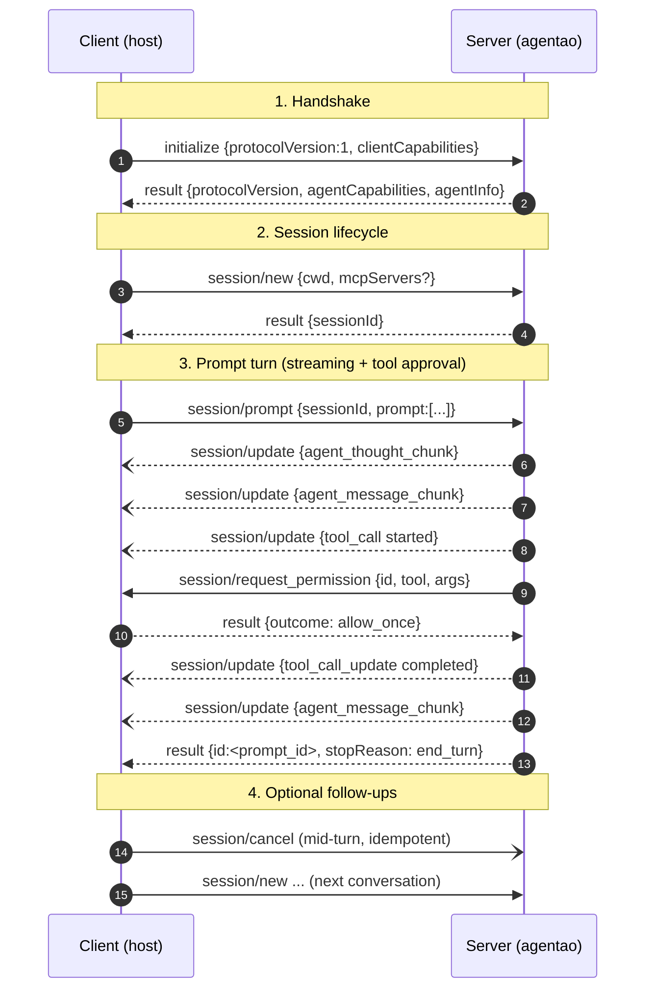

# 3.1 ACP Protocol Tour

**ACP = Agent Client Protocol** — a standardized stdio JSON-RPC 2.0 protocol that lets hosts ("clients") in any language drive agent runtimes ("servers"). Spearheaded by Zed Industries with a goal analogous to LSP for editors/language services: **make IDEs and agents speak the same wire.**

Spec: <https://agentclientprotocol.com/>

## Quick try in 60 seconds

Before reading the full protocol breakdown, run a real handshake to feel the shape:

```bash
pip install 'agentao[cli]>=0.4.0'
export OPENAI_API_KEY=sk-... OPENAI_BASE_URL=https://api.openai.com/v1 OPENAI_MODEL=gpt-5.4

agentao --acp --stdio
```

The process now reads JSON-RPC requests on stdin and writes responses + notifications on stdout. Paste these three NDJSON lines (one per line) into the same terminal:

```json
{"jsonrpc":"2.0","id":1,"method":"initialize","params":{"protocolVersion":1,"clientCapabilities":{}}}
{"jsonrpc":"2.0","id":2,"method":"session/new","params":{"cwd":"/tmp"}}
{"jsonrpc":"2.0","id":3,"method":"session/prompt","params":{"sessionId":"<id from step 2>","prompt":[{"type":"text","text":"hello"}]}}
```

You'll see, in order:

- `initialize` response — Agentao announces capabilities (`loadSession`, `mcpCapabilities`, …)
- `session/new` response — a fresh `sessionId`
- `session/update` notifications — streaming text, tool starts, thinking
- a final response with `stopReason` when the turn ends

### Real host (Node skeleton)

```javascript
import { spawn } from 'node:child_process';

const proc = spawn('agentao', ['--acp', '--stdio']);
let nextId = 1;

function send(method, params) {
  const msg = { jsonrpc: '2.0', id: nextId++, method, params };
  proc.stdin.write(JSON.stringify(msg) + '\n');
}

proc.stdout.on('data', (buf) => {
  for (const line of buf.toString().split('\n').filter(Boolean)) {
    const msg = JSON.parse(line);
    if (msg.method === 'session/update') {
      handleUpdate(msg.params);              // streamed text, tool events, thinking
    } else if (msg.method === 'session/request_permission') {
      showPermissionDialog(msg.params);       // your approval UI
    } else if (msg.id) {
      resolvePending(msg.id, msg);            // response
    }
  }
});

send('initialize', { protocolVersion: 1, clientCapabilities: {} });
// next: send('session/new', { cwd: '/your/project' })
// then: send('session/prompt', { sessionId, prompt: [{type:'text', text:'hello'}] })
```

::: tip Four things that catch first-timers
- Framing is **NDJSON** (newline-delimited JSON) — not WebSocket, not raw stdout
- Handshake order is mandatory: `initialize` → `session/new` → `session/prompt`
- `session/update` is a **notification** (no `id`) — do not respond to it
- `session/request_permission` is a **request** (has `id`) — the host must reply in reasonable time
:::

The rest of this section explains *why* each of those four exists.

## How ACP relates to MCP

ACP and MCP are **complementary**, not competitors:

| Protocol | Direction | Typical client | Typical server | Role |
|----------|-----------|----------------|----------------|------|
| **ACP** | Host ↔ Agent | IDE, web UI, CLI | Agent runtime (e.g. Agentao) | Expose the agent to UI |
| **MCP** | Agent ↔ Tools | Agent runtime | Tools / data sources (filesystem, GitHub, databases…) | Expose tools to the agent |

```
┌────────────┐   ACP    ┌────────────┐   MCP    ┌─────────────┐
│   Client    │◄────────►│   Agent     │◄────────►│ MCP Tools  │
│ (your host) │           │  (Agentao)  │           │ (resources)│
└────────────┘           └────────────┘           └─────────────┘
```

Agentao is simultaneously an **ACP server** (driven by hosts) and an **MCP client** (drives external tools).

## Why ACP

| Need | How ACP addresses it |
|------|----------------------|
| Non-Python host | stdio + JSON — any language can integrate |
| Process isolation | Agent runs in a subprocess; a crash does not kill the host |
| Swappable agent backend | Agentao, Claude Code, Zed's built-in agent all speak the same protocol |
| Auditable | On-the-wire JSON is naturally dumpable / replayable / diffable |

## Protocol characteristics

- **Transport**: stdin/stdout (v1 only)
- **Framing**: NDJSON — one complete JSON object per line, delimited by `\n`
- **RPC**: JSON-RPC 2.0
- **Connection model**: one client ↔ one server, long-lived
- **Version**: integer `ACP_PROTOCOL_VERSION = 1` (strictly typed, not a date string)
- **Capability negotiation**: both sides advertise supported features during `initialize`

## The four message quadrants

```
         Request (has id)              Notification (no id)
        ──────────────────────────── ────────────────────────────
Client  initialize, session/new,      (not used in v1)
 →      session/prompt, session/cancel,
Server  session/load
        ──────────────────────────── ────────────────────────────
Server  session/request_permission,   session/update
 →      _agentao.cn/ask_user            (streaming text, tool events, thinking…)
Client
```

**Key points**:

- Client → Server is the **active driver** (start session, send prompt, cancel)
- Server → Client sends both **notifications** (continuous streaming updates) and **requests** (asks the user to approve a tool)
- Both directions are multiplexed over the **same stdio pair**; JSON-RPC `id` separates requests from responses

## A full round-trip



::: tip Reading the diagram
- **Solid arrow** (→) = JSON-RPC **request** (has `id`, must be answered)
- **Dashed arrow** (-->) = JSON-RPC **response** to a prior request
- **`--)`** = JSON-RPC **notification** (no `id`, no reply allowed)
:::

## Extension: `_agentao.cn/ask_user`

The base spec only lets the server **request permission** — it does not let the server ask the user a free-form question. Agentao advertises a private extension method `_agentao.cn/ask_user` in the `extensions` field to do exactly that. Client options:

- Implement it: prompt the user, return the answer string
- Don't implement: the agent falls back to `"[ask_user: not available in non-interactive mode]"`

## ACP v1 boundaries

Explicit v1 limits (Agentao's capability block reflects them faithfully):

- `promptCapabilities.image = false`, `audio = false`, `embeddedContext = false` — prompts are text-only
- `mcpCapabilities.http = false`, `sse = true` — MCP transport is stdio + SSE only
- `authMethods = []` — no protocol-level auth; credentials flow via env vars

Future versions will expand these. **Clients should inspect the handshake response** before deciding what prompt format to send.

## What's next

- **3.2** Step-by-step Agentao-as-server with complete wire traces
- **3.3** Build a host ACP client skeleton
- **3.4** Reverse: Agentao calling other ACP servers
- **3.5** Zed integration

→ [3.2 Agentao as an ACP Server](./2-agentao-as-server)
