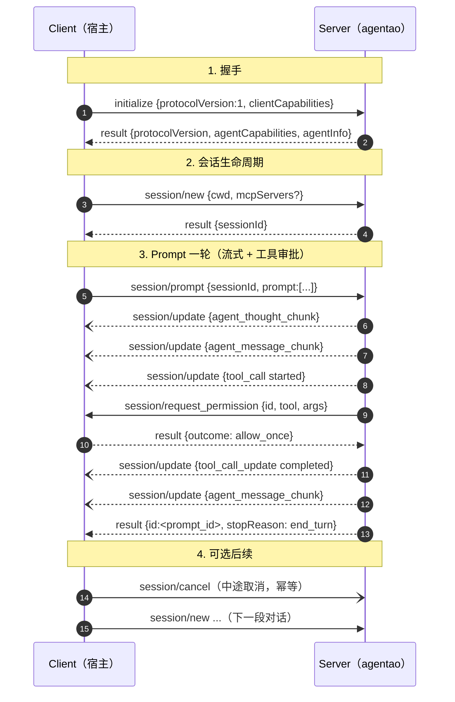

# 3.1 ACP 协议速览

**ACP = Agent Client Protocol**——一个标准化的 stdio JSON-RPC 2.0 协议，让任何语言的宿主（"Client"）能够驱动 Agent 运行时（"Server"）。由 Zed Industries 领衔推动，目标与 LSP 在编辑器/语言服务之间的角色类似：**"让 IDE 和 Agent 之间说同一种话"**。

官方规范：<https://agentclientprotocol.com/>

## 60 秒快速尝鲜

在读完整协议拆解之前，先跑一次真实握手，感受一下形态：

```bash
pip install 'agentao[cli]>=0.4.0'
export OPENAI_API_KEY=sk-... OPENAI_BASE_URL=https://api.openai.com/v1 OPENAI_MODEL=gpt-5.4

agentao --acp --stdio
```

此时进程通过 stdin 读 JSON-RPC 请求，stdout 写响应和通知。把下面 3 条 NDJSON（每行一条）粘进同一个终端：

```json
{"jsonrpc":"2.0","id":1,"method":"initialize","params":{"protocolVersion":1,"clientCapabilities":{}}}
{"jsonrpc":"2.0","id":2,"method":"session/new","params":{"cwd":"/tmp"}}
{"jsonrpc":"2.0","id":3,"method":"session/prompt","params":{"sessionId":"<上一步返回的 id>","prompt":[{"type":"text","text":"你好"}]}}
```

你会依次看到：

- `initialize` 响应——Agentao 宣告自己支持的能力（`loadSession`、`mcpCapabilities` 等）
- `session/new` 响应——返回新建的 `sessionId`
- 一连串 `session/update` 通知——流式文本、工具调用开始、思考过程
- 最后一个带 `stopReason` 的响应表示本轮结束

### 真实宿主的做法（Node 骨架）

```javascript
import { spawn } from 'node:child_process';

const proc = spawn('agentao', ['--acp', '--stdio']);
let nextId = 1;

function send(method, params) {
  const msg = { jsonrpc: '2.0', id: nextId++, method, params };
  proc.stdin.write(JSON.stringify(msg) + '\n');
}

proc.stdout.on('data', (buf) => {
  for (const line of buf.toString().split('\n').filter(Boolean)) {
    const msg = JSON.parse(line);
    if (msg.method === 'session/update') {
      handleUpdate(msg.params);              // 流式文本、工具事件、思考
    } else if (msg.method === 'session/request_permission') {
      showPermissionDialog(msg.params);       // 弹出确认 UI
    } else if (msg.id) {
      resolvePending(msg.id, msg);            // 响应
    }
  }
});

send('initialize', { protocolVersion: 1, clientCapabilities: {} });
// 然后：send('session/new', { cwd: '/your/project' })
// 再然后：send('session/prompt', { sessionId, prompt: [{type:'text', text:'你好'}] })
```

::: tip 第一次接触最容易踩的 4 个点
- 协议帧是 **NDJSON**（按换行分隔的 JSON）——不是 WebSocket，也不是裸 stdout
- 握手顺序固定：`initialize` → `session/new` → `session/prompt`
- `session/update` 是**通知**（不带 `id`）——不要回它
- `session/request_permission` 是**请求**（带 `id`）——宿主必须在合理时间内回复
:::

后面的小节会逐一解释这 4 点为什么是这样。

## 与 MCP 的关系

MCP 和 ACP 是**互补**而非竞争：

| 协议 | 方向 | 典型客户端 | 典型服务端 | 角色 |
|------|------|----------|----------|------|
| **ACP** | Host ↔ Agent | IDE、Web UI、CLI | Agent 运行时（如 Agentao） | 把 Agent 暴露给 UI |
| **MCP** | Agent ↔ Tools | Agent 运行时 | 工具/数据源（文件系统、GitHub、数据库…） | 把工具暴露给 Agent |

```
┌────────────┐   ACP    ┌────────────┐   MCP    ┌─────────────┐
│   Client    │◄────────►│   Agent     │◄────────►│ MCP Tools  │
│ (你的宿主)   │           │  (Agentao)  │           │ (资源/API) │
└────────────┘           └────────────┘           └─────────────┘
```

Agentao 同时是 **ACP Server**（被宿主驱动）和 **MCP Client**（驱动外部工具）。

## 为什么选 ACP

| 诉求 | ACP 的满足方式 |
|------|--------------|
| 非 Python 宿主 | stdio + JSON，任意语言都能集成 |
| 进程隔离 | Agent 跑在子进程里，崩溃不影响宿主 |
| 可替换 Agent 实现 | Agentao、Claude Code、Zed's built-in agent 等均符合同一协议 |
| 可审计 | JSON 线上报文天然可被 dump / replay / diff |

## 协议特征

- **传输层**：stdin/stdout（v1 仅此一种）
- **帧格式**：NDJSON——每行一条完整 JSON 对象，`\n` 分隔
- **RPC 规范**：JSON-RPC 2.0
- **连接模型**：单客户端 ↔ 单服务端，长连接
- **协议版本**：整数 `ACP_PROTOCOL_VERSION = 1`（严格类型，不是日期字符串）
- **能力协商**：`initialize` 握手时双方宣告各自支持的特性

## 消息四象限

```
         Request (有 id)                Notification (无 id)
        ─────────────────────────── ────────────────────────────
Client  initialize, session/new,      (v1 未定义)
 →      session/prompt, session/cancel,
Server  session/load
        ─────────────────────────── ────────────────────────────
Server  session/request_permission,   session/update
 →      _agentao.cn/ask_user           (流式文本、工具事件、思考…)
Client
```

**关键点**：
- Client → Server 是**主动驱动**（发起会话、发送提示、取消）
- Server → Client 既发**通知**（连续的流式更新），也发**请求**（要求用户批准某个工具）
- 所有方向都在**同一对 stdio**上多路复用，靠 JSON-RPC 的 `id` 字段区分请求/响应

## 典型一次完整交互



::: tip 怎么读这张图
- **实线箭头**（→）= JSON-RPC **请求**（带 `id`，必须回复）
- **虚线箭头**（-->）= 对前一个请求的 **响应**
- **`--)`** = JSON-RPC **通知**（无 `id`，禁止回复）
:::

## 扩展：`_agentao.cn/ask_user`

协议标准里 Server 只能**请求权限**而不能**向用户追问文本**。Agentao 通过 `extensions` 机制宣告了一个私有扩展方法 `_agentao.cn/ask_user`，用来从 Server 向 Client 反问任意问题。Client 可以：

- 实现它：把问题弹给用户、拿到答复后返回字符串
- 不实现：Agent 会 fallback 到 `"[ask_user: not available in non-interactive mode]"`

## ACP v1 的边界

v1 协议的**明确限制**（Agentao 能力字段如实反映）：

- `promptCapabilities.image = false`、`audio = false`、`embeddedContext = false`——提示体仅纯文本
- `mcpCapabilities.http = false`、`sse = true`——MCP 仅支持 stdio + SSE
- `authMethods = []`——协议层不做认证；凭据走环境变量

未来版本会扩展这些能力。Client 代码应**检查握手响应**再决定传什么格式的提示。

## 下一步

- **3.2** 手把手用 Agentao 当 ACP Server，含完整消息线
- **3.3** 构建宿主 ACP Client 的骨架
- **3.4** 反向：Agentao 调用其他 ACP Server
- **3.5** Zed 真机集成

→ [3.2 Agentao 作为 ACP Server](./2-agentao-as-server)
