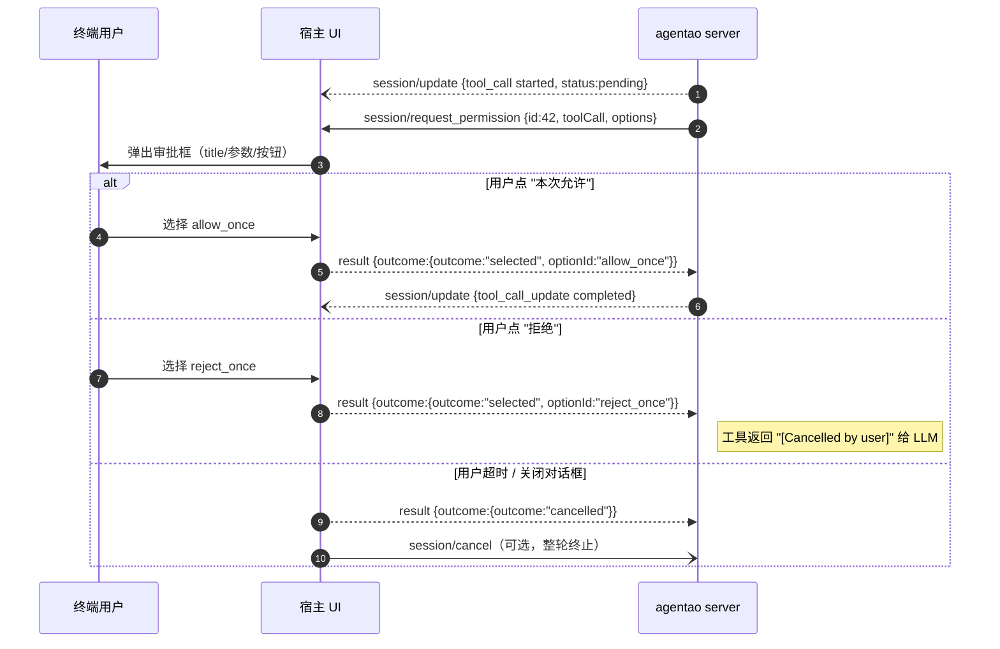
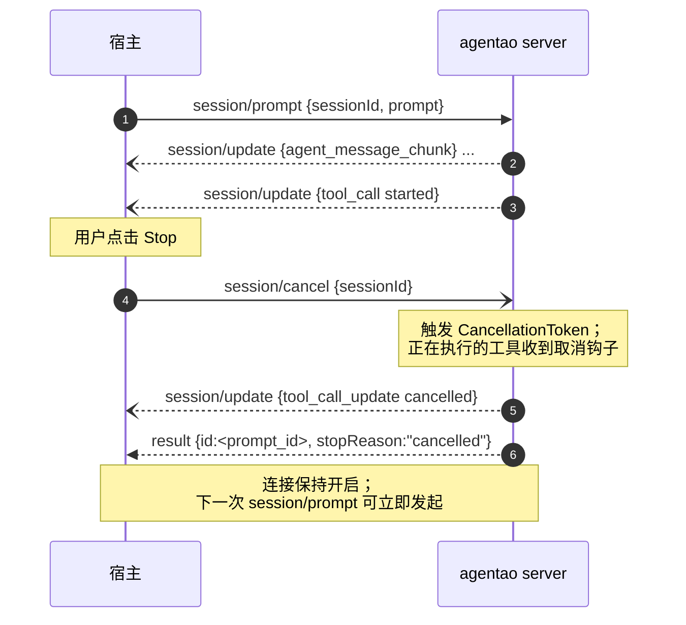

# 3.2 Agentao 作为 ACP Server

把 Agentao 当成黑盒 ACP Server 驱动——这是**任意语言**宿主（Node / Go / Rust / Kotlin / Swift / C#…）的集成路径。

## 启动命令

```bash
agentao --acp --stdio
```

- `--acp` 打开 ACP 模式
- `--stdio` 明确传输层（v1 只支持 stdio，但必须显式写上）
- 进程会一直运行直到 stdin 关闭或接收到 `SIGTERM`

**环境变量**：和 CLI / SDK 完全一致（`OPENAI_API_KEY` 等）——ACP 协议层不负责凭据传递。

**日志**：Agentao 会把日志写入 `<session-cwd>/agentao.log`（ACP 握手里客户端传入的 `cwd`）。宿主可以轮询/监听这个文件做调试。

## 完整方法清单

### 宿主 → Agent（5 个请求方法）

| 方法 | 作用 | 关键参数 |
|------|------|---------|
| `initialize` | 握手 + 能力协商 | `protocolVersion:int, clientCapabilities:obj, clientInfo?:obj` |
| `session/new` | 创建新会话 | `cwd:string, mcpServers?:array` |
| `session/prompt` | 发送一轮用户提示 | `sessionId:string, prompt:array<PromptChunk>` |
| `session/cancel` | 取消进行中的 prompt | `sessionId:string` |
| `session/load` | 从历史恢复会话 | `sessionId:string, history:array` |

### Agent → 宿主（1 个请求、1 个通知、1 个扩展）

| 方法 | 性质 | 作用 |
|------|------|------|
| `session/update` | 通知 | 流式事件：文本 chunk、思考、工具调用状态 |
| `session/request_permission` | 请求（需 Client 应答） | 请求批准危险工具（写文件、跑 shell 等） |
| `_agentao.cn/ask_user` | 请求（扩展） | 向用户追问文本 |

## 握手 `initialize`

**请求**：

```json
{
  "jsonrpc": "2.0",
  "id": 1,
  "method": "initialize",
  "params": {
    "protocolVersion": 1,
    "clientCapabilities": {},
    "clientInfo": {
      "name": "my-ide",
      "version": "1.0.0"
    }
  }
}
```

**Agentao 响应**：

```json
{
  "jsonrpc": "2.0",
  "id": 1,
  "result": {
    "protocolVersion": 1,
    "agentCapabilities": {
      "loadSession": true,
      "promptCapabilities": {
        "image": false,
        "audio": false,
        "embeddedContext": false
      },
      "mcpCapabilities": {
        "http": false,
        "sse": true
      }
    },
    "authMethods": [],
    "agentInfo": {
      "name": "agentao",
      "title": "Agentao",
      "version": "0.2.14"
    },
    "extensions": [
      {
        "method": "_agentao.cn/ask_user",
        "description": "Request free-form text input from the user."
      }
    ]
  }
}
```

### 规则要点

- `protocolVersion` 必须是**整数**（`"1"` 字符串、`True` 都会被拒）
- 版本协商：若你传的版本 Agentao 支持，原样回传；否则回传 Agentao 支持的最高版本。**不报错**——由 Client 决定是否继续
- `clientCapabilities` 是 `{}` 也必须传（必填，类型必须是 object）

## 创建会话 `session/new`

```json
{
  "jsonrpc": "2.0",
  "id": 2,
  "method": "session/new",
  "params": {
    "cwd": "/path/to/user/project",
    "mcpServers": [
      {
        "name": "github",
        "type": "stdio",
        "command": "npx",
        "args": ["-y", "@modelcontextprotocol/server-github"],
        "env": [{"name":"GITHUB_TOKEN","value":"<secret>"}]
      }
    ]
  }
}
```

**响应**：

```json
{"jsonrpc":"2.0","id":2,"result":{"sessionId":"sess-a1b2c3"}}
```

### 关键说明

- `cwd` 决定了这个会话的**工作目录**——文件工具、`AGENTAO.md`、`.agentao/` 全部相对它。多会话并发时务必不同
- `mcpServers` 只接受 `"type":"stdio"` 或 `"type":"sse"`（因为 `mcpCapabilities.http=false`）
- 这些 MCP 配置被内部映射为 [`extra_mcp_servers` 参数](/zh/part-2/2-constructor-reference#会话级-mcp-服务器)

## 发送提示 `session/prompt`

```json
{
  "jsonrpc": "2.0",
  "id": 3,
  "method": "session/prompt",
  "params": {
    "sessionId": "sess-a1b2c3",
    "prompt": [
      {"type": "text", "text": "找到 3 个最大的 .py 文件"}
    ]
  }
}
```

v1 `prompt` 数组里只能放 `{"type":"text", "text": ...}`。

**响应**（一次 prompt 的最终**结果**）会在所有流式更新结束后返回：

```json
{
  "jsonrpc":"2.0",
  "id":3,
  "result":{
    "stopReason":"end_turn"
  }
}
```

`stopReason` 取值：`end_turn`（正常完成）、`max_tokens`、`cancelled`、`refusal`、`error` 等。

## 流式更新 `session/update`（通知）

在 `session/prompt` 返回前，Agentao 会发出**多条**：

```json
{
  "jsonrpc":"2.0",
  "method":"session/update",
  "params":{
    "sessionId":"sess-a1b2c3",
    "update":{
      "sessionUpdate":"agent_message_chunk",
      "content":{"type":"text","text":"我来帮你"}
    }
  }
}
```

`sessionUpdate` 字段的关键值：

| 值 | 含义 |
|----|------|
| `agent_message_chunk` | 流式文本 chunk |
| `agent_thought_chunk` | 思考过程（如果启用） |
| `tool_call` | 工具开始调用 |
| `tool_call_update` | 工具执行进度/输出 |

宿主不应对通知响应（JSON-RPC 2.0 规范：通知无 `id`）。

## 工具确认 `session/request_permission`（请求）

当 Agentao 尝试调用一个 `requires_confirmation=True` 的工具时：

```json
{
  "jsonrpc":"2.0",
  "id":42,
  "method":"session/request_permission",
  "params":{
    "sessionId":"sess-a1b2c3",
    "toolCall":{
      "toolCallId":"call-x",
      "status":"pending",
      "title":"Run: rm -rf build/",
      ...
    },
    "options":[
      {"optionId":"allow_once","name":"Allow once","kind":"allow_once"},
      {"optionId":"reject_once","name":"Reject","kind":"reject_once"}
    ]
  }
}
```

**宿主必须响应**（否则 Agent 会阻塞直到超时）：

```json
{
  "jsonrpc":"2.0",
  "id":42,
  "result":{
    "outcome":{"outcome":"selected","optionId":"allow_once"}
  }
}
```

建议的宿主 UI 流程：
1. 收到请求 → 弹出模态框展示 `title` 和 `toolCall` 细节
2. 用户选择 → 立即 `result` 响应
3. 若用户超时不响应，宿主主动响应 `{"outcome":"cancelled"}` 并可选 `session/cancel`



## 取消 `session/cancel`

```json
{"jsonrpc":"2.0","id":99,"method":"session/cancel","params":{"sessionId":"sess-a1b2c3"}}
```

效果：当前 `session/prompt` 的轮次会以 `stopReason:"cancelled"` 结束。幂等——重复调用不会出错。



**幂等性** —— 当前轮次已结束后再发一次 `session/cancel` 不会报错（不会抛、不会再发额外通知）。

## 恢复会话 `session/load`

用于**持久化会话**场景：你把 `sessionId` + 历史消息存到数据库，进程重启后 restore。Agentao 在 `initialize` 响应里声明 `loadSession:true` 表示支持。

```json
{
  "jsonrpc":"2.0",
  "id":5,
  "method":"session/load",
  "params":{
    "sessionId":"sess-restored",
    "cwd":"/path/to/project",
    "history":[
      {"role":"user","content":[{"type":"text","text":"先前的问题"}]},
      {"role":"assistant","content":[{"type":"text","text":"先前的答复"}]}
    ]
  }
}
```

## ⚠️ 常见陷阱

::: warning ACP 协议层最容易踩的坑
1. **帧格式**：一定是 NDJSON，JSON 里**不能有裸换行**——写 JSON 库时注意 compact 模式
2. **stdout 污染**：Agentao 保证所有日志走 `agentao.log` + stderr，**不污染 stdout**。你的 Client 读 stdout 一定拿到纯 JSON
3. **stdin 阻塞**：如果 Client 在发送请求后不读 stdout，Server 的 stdout buffer 会撑爆。用异步 I/O 或专门读取线程
4. **版本字段类型**：`protocolVersion` 必须 int，不是日期字符串
5. **`session/update` 不回应**：JSON-RPC 2.0 禁止为通知发响应
:::

## 端到端最小宿主（Python 实现，仅作演示）

::: tip ⚡ 端到端可跑（约 5 分钟）
**产出** —— 从 50 行 Python 客户端驱动 `agentao --acp --stdio`；能看到 `session/update` 流式通知 + 最终 `stopReason`。
**技术栈** —— `pip install 'agentao[cli]>=0.4.0'` + 3 个环境变量；下方 Python 即所需的全部宿主代码。
**运行** —— 粘贴到 `acp_demo.py`，然后 `python acp_demo.py`。
**宿主不是 Python？** —— 读懂线协议流后，照 [3.3 宿主作为 ACP Client](./3-host-client-architecture) 翻译到目标语言。
:::

即便你的宿主不是 Python，这个例子也帮助理解协议流：

```python
"""最小 ACP 客户端（Python），驱动 agentao --acp --stdio。"""
import json, subprocess, threading, queue, uuid

class AcpClient:
    def __init__(self):
        self.proc = subprocess.Popen(
            ["agentao", "--acp", "--stdio"],
            stdin=subprocess.PIPE, stdout=subprocess.PIPE,
            bufsize=0, text=True,
        )
        self._pending: dict = {}
        self._notifications: queue.Queue = queue.Queue()
        threading.Thread(target=self._reader, daemon=True).start()

    def _reader(self):
        for line in self.proc.stdout:
            msg = json.loads(line)
            if "id" in msg and "method" not in msg:        # 是响应
                fut = self._pending.pop(msg["id"], None)
                if fut: fut.put(msg)
            elif "method" in msg and "id" not in msg:       # 是通知
                self._notifications.put(msg)
            elif "method" in msg and "id" in msg:           # 是请求（Agent→Client）
                self._notifications.put(msg)

    def call(self, method, params):
        id_ = str(uuid.uuid4())
        fut: queue.Queue = queue.Queue(maxsize=1)
        self._pending[id_] = fut
        msg = {"jsonrpc":"2.0","id":id_,"method":method,"params":params}
        self.proc.stdin.write(json.dumps(msg) + "\n"); self.proc.stdin.flush()
        return fut.get()

    def respond(self, id_, result):
        msg = {"jsonrpc":"2.0","id":id_,"result":result}
        self.proc.stdin.write(json.dumps(msg) + "\n"); self.proc.stdin.flush()

# 使用
cli = AcpClient()
print(cli.call("initialize", {"protocolVersion":1,"clientCapabilities":{}}))
r = cli.call("session/new", {"cwd":"/tmp"})
sid = r["result"]["sessionId"]
# 异步监听通知队列，同时发 prompt
cli.call("session/prompt", {
    "sessionId": sid,
    "prompt":[{"type":"text","text":"列 3 个最大文件"}],
})
```

生产级 Client 代码范式（错误处理、UI 桥接、超时）见 [3.3](#)（撰写中）。

## 关键源码位置

| 话题 | 文件 |
|------|------|
| 启动入口 | `agentao/cli/entrypoints.py:254-389` |
| 协议常量 | `agentao/acp/protocol.py:18, 47-58` |
| 握手 | `agentao/acp/initialize.py` |
| 能力宣告 | `agentao/acp/initialize.py:53-76` |
| 会话创建 | `agentao/acp/session_new.py` |
| Prompt 处理 | `agentao/acp/session_prompt.py` |

→ [第 4 部分 · 事件层与 UI 集成](/zh/part-4/)（撰写中）
