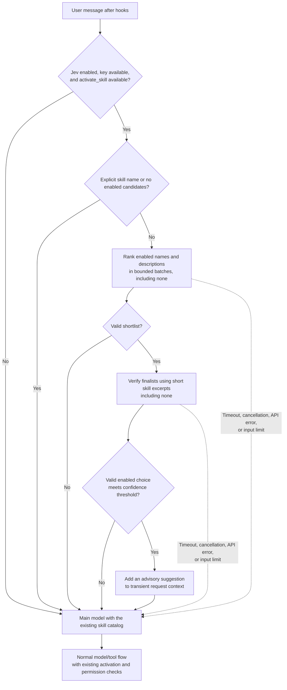

# Optional Jev skill suggestions

Jev adds a skill suggestion to the main model's current request. It is **off by
default** and does not replace the main model, activate a skill, or grant tool
permissions. The existing skill catalog and `/skills` commands still work.

## What Jev adds

[Jev](https://typesafe.ai/blog/introducing-system-one-models-and-jev) is TypeSafe's
System One model for typed decisions over supplied state. Its API supports
yes/no, choice, and score questions; this integration uses choice questions to
select from known skills, with an explicit none option. See TypeSafe's
[skill-suggestion cookbook](https://docs.typesafe.ai/cookbooks/skill_suggestion).

With a large or overlapping skill catalog, an independent selection step can
offer the main model a focused candidate. This is an optional experiment, not a
requirement for Agentao: recommendation quality improvements have not been
benchmarked here. It adds external API calls and latency, and sends request and
skill text to TypeSafe. The stable catalog remains available to the main model,
so this change does not claim prompt-token savings. Typed choices and confidence
scores do not guarantee a correct skill selection.

## Recommendation flow



The usual eligible turn makes two requests: ranking and verification. Larger
catalogs may need several ranking batches, within the same total time budget.
Failures and abstentions continue through the ordinary Agentao path.

## Quick start

In the interactive Agentao CLI:

```text
/jev on
/jev status
/jev save
```

If no key is available, `on` opens a hidden input prompt. After entering the
TypeSafe key, choose whether to save it for future sessions. Declining storage
uses the key for this session only. `setup` also lets you replace a key.
Never put a real key in a slash-command argument or chat message.

| Command | Effect |
|---|---|
| `/jev on` | Enable for this session; prompt for a missing key. |
| `/jev off` | Disable for this session and remove the current suggestion. |
| `/jev status` | Show configuration and a fixed result status; never show the key. |
| `/jev setup` | Enter a hidden key, optionally save it user-wide. Does not enable Jev. |
| `/jev save` | Persist the current Jev settings for this project, without the key. |

Without `save`, on/off does not change the next session. Saving a key and saving
the enabled setting are separate choices.

## Key storage

Startup resolves the first nonempty key from:

1. Process environment variable `TYPESAFE_API_KEY`.
2. `TYPESAFE_API_KEY` in the project's `.env`.
3. `typesafe_api_key` in `~/.agentao/credentials.json`.

Interactive setup overrides the key for the current service. On the next
startup, the precedence above applies again. The project `.env` key is read
without copying it into the process environment, so embedding two project roots
does not share their keys.

The optional user credential file stores **plaintext**, outside the repository.
Writes are atomic and preserve other entries; POSIX uses mode 0600, while
Windows inherits the user directory's normal ACL. This is not an OS credential
vault. Keep project `.env` files out of version control. Keys are never saved in
`.agentao/settings.json`, recommendation context, or command output, and
`TYPESAFE_API_KEY` is removed from Agentao's default child-process environment.

## Settings and fallback

See the [configuration reference](../reference/configuration.md#12-jev-skill-suggestions)
for the `jev` settings block. Defaults: `jev-1.13.0`, 10,000 ms total wait,
minimum confidence 0.7, and `suggest` mode only. Confidence is a model
distribution statistic, not a measured accuracy guarantee.

Each eligible user turn runs a ranking pass over enabled skill names/descriptions,
then verifies the finalists using short skill-content excerpts. Explicit skill
names take precedence, including disabled names; Jev is skipped in that case.
The suggestion is transient request context, never conversation history.

An enabled service sends the current request text and skill metadata/excerpts
to **TypeSafe**. It does not send conversation history or workspace files other
than the skill excerpts. Descriptions and request text can contain private
information; enable it for projects where that transfer is appropriate.

No key, timeout, cancellation, API errors, low confidence, or no matching skill
all fall back to normal Agentao behavior. There are no automatic retries. Each
service allows one in-flight worker; a late result is discarded. Requests have
text/byte limits and batches reserve one of Choice's 255 options for `none`.
Oversized inputs or more than 12 finalists fall back instead of silently dropping
candidate winners. Cancelling stops waiting immediately; an in-flight HTTP
operation may finish within its own I/O timeout.

Status values include `recommended`, `no-recommendation`, `missing-key`,
`explicit-skill`, `disabled`, `no-candidates`, `busy`, `cancelled`,
`timeout`, `authentication-error` (401/403), and `unavailable`.
Use `/jev setup` for an authentication error; check connectivity, service
availability, or the configured model for `unavailable`. Raw server errors and
payloads are not printed.

## Embedding

`Agentao(...)` remains environment-free. Explicitly inject one
`JevSkillRecommender` per agent, and close the agent when finished:

```python
from agentao import Agentao
from agentao.recommendations import JevConfig, JevSkillRecommender

# The host supplies both secrets; this example does not discover configuration.
recommender = JevSkillRecommender(
    config=JevConfig(enabled=True),
    api_key=typesafe_key,
)
agent = Agentao(
    api_key=llm_key, base_url=llm_url, model=llm_model,
    working_directory=project_root,
    skill_recommender=recommender,
)
try:
    answer = agent.chat("Help organize these notes")
finally:
    agent.close()
```

`build_from_environment(working_directory=...)` loads the project settings and
key sources automatically. Pass `skill_recommender=None` explicitly to opt out
of discovery. Child agents do not inherit the parent's recommender.

Protocol references: [TypeSafe API](https://docs.typesafe.ai/api) and
[skill suggestion cookbook](https://docs.typesafe.ai/cookbooks/skill_suggestion).
