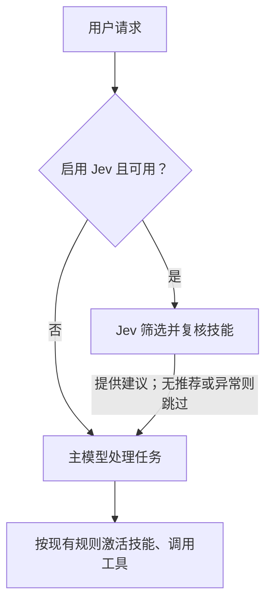

# 可选的 Jev 技能推荐

Jev 为主模型的当前请求提供技能建议，**默认关闭**。它不会替换主模型、直接激活
技能或授予工具权限。原有技能目录及 `/skills` 命令照常工作。

## Jev 是什么，为什么加入

[Jev](https://typesafe.ai/blog/introducing-system-one-models-and-jev) 是 TypeSafe
面向结构化决策的 System One 模型：根据输入状态回答是否、选择或评分问题。
本功能使用选择题，从已知技能中选一个候选，并提供 `none` 选项。
接口设计参考官方[技能推荐示例](https://docs.typesafe.ai/cookbooks/skill_suggestion)。

技能较多、描述相近时，独立的选择步骤可以为主模型提供一个聚焦的候选。
这是可选的辅助能力，并非 Agentao 的运行必需项；本次尚未通过大规模评测证明
推荐质量提升。启用会增加外部 API 调用、等待时间，并向 TypeSafe 发送请求和技能文本。
原有完整技能目录仍交给主模型，因此不声称节省目录占用的提示词 token。
结构化输出和置信度也不等于技能选择一定正确。

## 推荐流程



通常每个符合条件的回合调用两次：排序和复核。大型目录可能需要多批排序，
所有请求共享总时间预算；失败或弃权时继续原有流程。

## 快速开始

在 Agentao 交互式 CLI 中输入：

```text
/jev on
/jev status
/jev save
```

没有配置 Key 时，`on` 会打开隐藏输入框。输入 TypeSafe Key 后，可以选择是否
保存供以后使用；选择不保存，就只在本次会话使用。`setup` 可以重新输入 Key。
不要把真实 Key 放在斜杠命令参数或聊天消息中。

| 命令 | 作用 |
|---|---|
| `/jev on` | 本次会话启用；缺少 Key 时引导输入。 |
| `/jev off` | 本次会话关闭，并移除当前建议。 |
| `/jev status` | 查看配置和固定状态码，不显示 Key。 |
| `/jev setup` | 隐藏输入 Key，可选择保存到用户目录；不自动启用 Jev。 |
| `/jev save` | 保存当前 Jev 设置到本项目，不包含 Key。 |

不执行 `save` 时，开关不会影响下一次会话。保存 Key 和保存启用状态是两个独立选择。

## Key 的保存方式

启动时按以下顺序取第一个非空值：

1. 进程环境变量 `TYPESAFE_API_KEY`。
2. 本项目 `.env` 中的 `TYPESAFE_API_KEY`。
3. `~/.agentao/credentials.json` 中的 `typesafe_api_key`。

交互式输入可覆盖当前服务使用的 Key；下次启动重新按上述优先级读取。
项目 `.env` 中的 Key 不会复制到进程环境，嵌入多个项目时不会互相污染。

可选的用户凭据文件位于仓库之外，采用**明文**保存。写入是原子的，并保留其他
条目；POSIX 设置 0600 权限，Windows 继承用户目录的常规 ACL。这不是系统凭据库。
项目 `.env` 应排除在版本控制之外。Key 不会写入 `.agentao/settings.json`、
推荐上下文或命令输出；Agentao 默认的子进程环境也会移除 `TYPESAFE_API_KEY`。

## 设置与回退

`jev` 配置块见[配置参考](../reference/configuration.zh.md#12-jev-技能推荐)。
默认模型 `jev-1.13.0`，总等待时间 10,000 毫秒，最低置信度 0.7，
仅支持 `suggest` 模式。置信度是模型输出分布的统计值，不代表经过验证的准确率。

每个符合条件的用户回合先根据启用技能的名称和描述排序，再利用简短技能正文
复核候选。用户明确点名技能时跳过 Jev，包括点名已禁用的技能。
建议只出现在本回合请求上下文中，不写入对话历史。

启用后会把当前请求文本、技能名称、描述和部分正文发送给 **TypeSafe**，
不会发送对话历史或技能摘录以外的工作区文件。请求和技能文本可能含有私有
信息，请在适合这种数据传输的项目中启用。

缺 Key、超时、取消、API 错误、低置信度或无匹配时，都回退到原有 Agentao 流程。
不自动重试；每个服务最多一个进行中的工作线程，迟到结果会被丢弃。
请求具有文本和字节数上限，每批为 Choice 的 255 个选项预留一个 `none`。
输入过大或入围者超过 12 个时回退，不会静默丢弃入围技能。
取消会立即停止等待；已开始的 HTTP 操作可能在自身 I/O 超时内结束。

状态包括 `recommended`（已推荐）、`no-recommendation`（未推荐）、
`missing-key`、`explicit-skill`、`disabled`、`no-candidates`、
`busy`、`cancelled`、`timeout`、`authentication-error`（401/403）
及 `unavailable`。鉴权失败可用 `/jev setup` 重新设置；
不可用时检查网络、服务状态和模型配置。不会输出原始服务端错误或请求内容。

## 嵌入应用

`Agentao(...)` 构造函数不读取环境或磁盘中的 Jev 配置。宿主通过新增的
仅限关键字参数 `skill_recommender=` 注入 `JevSkillRecommender`，每个 Agent
使用独立实例；详见[英文示例](jev-skills.md#embedding)。`agent.close()` 会关闭服务。

`build_from_environment(working_directory=...)` 自动加载项目配置及凭据；
显式传入 `skill_recommender=None` 可退出自动发现。
子 Agent 不会继承父 Agent 的推荐服务。

接口依据：[TypeSafe API](https://docs.typesafe.ai/api)、
[技能推荐示例](https://docs.typesafe.ai/cookbooks/skill_suggestion)。
